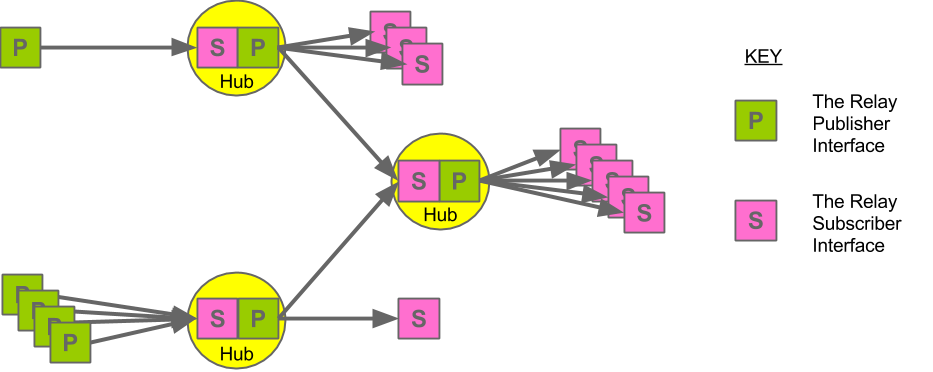

Relay
=====

_Publish and subscribe to anything._

    ------->
    P      S 
    <-------  

Specification
=============

Status: DRAFT
Author(s): Adam Griffiths

Abstract
--------

This document specifies Relay, an open, simple, web-scale and publish sububscribe protocol. Relay is inspired by and compatible with PubSubHubbub (PuSH) but has some additional features that you may find useful.

First of all Realy considers any server to be capable of being a Publisher, a Subscriber, a Hub or all three. What does this mean?

- A Subscriber gets a feed directly from a Publisher.
- A Publisher can have many Subscribers.
- A Subsriber can get a feed indirectly from a Hub which gets the feed from a Publisher.

A picture is worth a thousand words:

Notation and Conventions
------------------------

The key words "MUST", "MUST NOT", "REQUIRED", "SHALL", "SHALL NOT", "SHOULD", "SHOULD NOT", "RECOMMENDED", "MAY", and "OPTIONAL" in this document are to be interpreted as described in [RFC2119](). 

http://www.ietf.org/rfc/rfc2119.txt