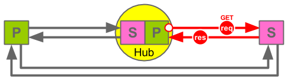

Relay
=====

_Publish. Subscribe. Syndicate._

    ------->
    P      S 
    <-------  

Specification
=============

Status: DRAFT

Author(s): Adam Griffiths

Abstract
--------

This document specifies "Relay", a syndication protocol for publishing and
subscribing to feeds.

Introduction
------------

Relay is inspired by and compatible with PubSubHubbub (PuSH) but has some
additional features that you might find useful. Realy considers any server to
be capable of being a Publisher, a Subscriber, a Hub or all three. What does
this mean? A picture is worth a thousand words:

In PuSH parlance Relay requires all Publishers are thier own Hubs. It alows
Publishers and Hubs to push feeds to Subscribers and other Hubs in exactly the
same way. This means Realy is as capable as, and compatible with PuSH, but
brings some additional benefits too, like:

* Publishers push to Hubs using exactly the same protocol as Hubs push to 
  Subscribers.
* A chain of Hubs can be created. 

There are also lots of other goodies in the Realy spec, so read on...

1. Notation and Conventions
---------------------------

The key words "MUST", "MUST NOT", "REQUIRED", "SHALL", "SHALL NOT", "SHOULD", "SHOULD NOT", "RECOMMENDED", "MAY", and "OPTIONAL" in this document are to be interpreted as described in [RFC2119](http://www.ietf.org/rfc/rfc2119.txt). 

2. Definitions
--------------

If you are familiure with PuSH you should find the following definaitions similar. 

__PuSH:__ When the word "push" is capitalised as "PuSH" it refers to PubSubHubbub, unless otherwise specifided, version 0.4.

__Topic/Feed: __ The words "feed" and "topic" are used intechangably. A Topic is the unit to which one can subscribe to. It is a collection of entries.

__Entry/Item:__ A topic is a collection of entries (Synonymous with a feed being a collection of items).

__Publisher:__ (_noun_). An entity that sends notifications of Changes to a Topic.

__Originating Publisher:__ (_noun_). The Publisher entity that owns a Topic. They are the originating source and the only system that authors changes to the topic.

__To publish:__ (_verb_). The process of notfying subscribers of changes to a Topic. The originating Publisher MUST _publish_ the Topic using the Relay specification. Other systems MAY also re-_publish_ the Topic, in which case they are acting as a Hub.

__Subscriber:__ (_noun_). An entity that receives notifications of changes to a Topic. 

__To subscribe:__ (_verb_). The process of requesing a Publisher publishes to a Subsciber on an on going basis. Usuaully initiated by the subscriber.

__Hub:__ An entity that both subscribers to a Topic and publishes it. A Hub re-publishes a Topic or you could say it relays it.

### IMPORTANT

A Hub is both a Publisher and a Subscriber.

In the following documentation, unless explicitly stated otherwise, anything that is specified for a Subscriber applies equally to a Hub. A Hub is a Subscriber to the Topics that it manages.

Likewise, anything that is specified for a Publisher applies equally to a Hub. A Hub is a Publisher of the Topics that it manages.

3. High-level protocol flow
----------------------------
(This section is non-normative.)

1. __Discovery__ - A Subscriber discovers a Topic from a Publisher and how
to subscribe to it. (_Identical to the PusH spec. See part 4_)

2. __Subscription__ - The Subscriber subscribes to the Topic to receive
notification when it changes. (_Identical to the
PusH spec. See part 3, 2nd bullet_). If the Subscriber is a Hub itself it
SHOULD make this known at the time of subscribtion. (_An extension to the PuSH
spec, see below.)

3. __Publishing__ - Publishers POST any topic changes to their subscriber(s)
(which many be Hubs). (_Compatible with the PusH spec part 3, 1st bullet.
Different to part 3, 3rd bullet, but that's fine as per part 6_)

4. __Relay-Publishing or Content Distribution__ - When Hubs receive POSTed
Topic changes the POST them on to their subscriber(s), which many also be
Hubs, so the chain continues until all Hubs and Subscribers are reached. 
(_Publishing and Relay-Publishing are done in an identical way and follow
the PusH spec part 7_)

5. __Handeling Failiures__ - Publishers SHOULD stop POSTing to Subscribers
after an agreed number of retrys fail. Both Publishers and Subscribers SHOULD
follow the Relay specification for detecting, altering and recovering failed
subscriptions.

6. __Catchup and History__ - Publishers SHOULD support one of two mechansims
to allo Subscribers to catchup or get historical Topic entries. This is usful
for Subscribers after recovering from a failiure or at the point of initial
subscription.

        Thin vs. Fat. Fat pings contain everything required to update the subscriber. Thin pings MAY require a subscriber calls back to the Publisher to get a complete copy of changed topic. Publishers MUST support fat pings and MAY support thin pings. Subscribers MUST suport the types of ping they intend to subscribe to, ideally this would be both to support general robustness.

        * The hub caches minimal metadata (id, data, entry digest) about each topic's previous state. When the hub re-fetches a topic feed (on its own initiative or as a result of a publisher's ping) and finds a delta, it enqueues a notification to all registered subscribers.

        * Realy also supports chaining, such that one Realy Publisher can publish to a chain or network of Realy Hubs which can eventaully pubish to a Realy Subscriber.

4. Discovery
------------

#### PuSH 
> 4\. Discovery

> A potential subscriber initiates discovery by retrieving (GET or HEAD
> request) the topic to which it wants to subscribe. The HTTP [RFC2616]
> response from the publisher MUST include at least one Link Header [RFC5988]
> with rel=hub (a hub link header) as well as exactly one Link Header
> [RFC5988] with rel=self (the self link header). The former MUST indicate the
> exact URL of a PubSubHubbub hub designated by the publisher. If more than
> one URL is specified, it is expected that the publisher pings each of these
> URLs, so the subscriber may subscribe to one or more of these. The latter
> will point to the permanent URL for the resource being polled.

> In the absence of HTTP [RFC2616] Link headers, subscribers MAY fall back to
> other methods to discover the hub(s) and the canonical URI of the topic. If
> the topic is an XML based feed, it MAY use embedded link elements as
> described in Appendix B of Web Linking [RFC5988]. Similarly, for HTML pages,
> it MAY use embedded link elements as described in Appendix A of Web Linking
> [RFC5988]. Finally, publishers MAY also use the Well-Known Uniform Resource
> Identifiers [RFC5785] .host-meta to include the <Linkelement with rel="hub".

#### Relay 

1. Adhere completely to the PuSH specification.

2. The the self link header SHOULD be equal to the topic_url (This specification 
   does not address the scenario if it is not).

3. There MAY be more than one hub link header. If so Subscribers MAY
   subscriber to one or more Hub. Subscribing to one is RECOMMENDED and
   Subscribers SHOULD use the first first hub link provided unless
   there is a logical reason not to. Publishes SHOULD put their prefered hub
   earlier in the order of hub link headers.

4. It is NOT RECOMENDED that Relay Publishers fall back to other methods methods of
   discovery mentioned in the PuSH 0.3 and PuSH 0.4 sepcification.

5. Realy Subscribers MAY OPTIONALLY fall back to alternative methods of
   discovery if they are required to support older PuSH Topics.

#### Examples (Non-normative)

 Subsriber makes a GET or HEAD request to Publicher for a topic.
    
    HEAD <topic_url> HTTP/1.1
    Host: <hostname.com>

 Publisher responds to Subscriber with the latest version of the topic and suitable headers

    HTTP/1.1 200 OK
    Content-Type: text/xml; charset=utf-8
    Content-Length: length
    Link: <hub_link_url>; rel=hub, <self_link_url>; rel=self

5. Subscribing and Unsubscribing
--------------------------------

#### PuSH 

> 5\. Subscribing and Unsubscribing

> Subscribing to a topic URL consists of four parts that may occur immediately 
> in sequence or have a delay.

> * Requesting a subscription using the hub
> * Validating the subscription with the publisher (OPTIONAL)
> * Confirming the subscription was actually desired by the subscriber
> * Periodically reconfirming the subscription is still active (OPTIONAL)

> Unsubscribing works in the same way, except with a single parameter changed 
> to indicate the desire to unsubscribe. Also, the Hub will not validate 
> unsubscription requests with the publisher.

#### Relay 

1. Adhere completely to the PuSH specification.

2. Relay refers to the parts that are involved in Subscribing and Unsubscribing as follows:
  * __Subscription Request__ - The Subscriber sends a Subscription Request to a Publisher (5.1) 
  * __Subscription Validation__ - The Publisher validiates the Subscription Request (5.2) 
  * __Verification of Subscriber Itent__ - The Publisher verifies the intent of the Subscriber (5.3) 
  * __Subscription Confirmation__ - The Subscriber ...

3. After a succesful Subscription Relay opperates in a similar way to PuSH with:
  * __ Publishing and Content Distribution__ - The Publisher sends all updates to the topic to the Subscriber (6 and 7) 

4. Each step request the previous step is succesful and in this process the
   Subscriber is given  a number of `lease_seconds` and MUST resubscribe before
   these have elapsed.

### 5.1. Subscription Request

_The Subscriber sends a Subscription Request to a Publisher_

#### PuSH

> 5.1\.  Subscriber Sends Subscription Request

> Subscription is initiated by the subscriber making an HTTPS [RFC2616] or
> HTTP [RFC2616] POST request to the hub URL. This request has a Content-Type
> of application/x-www-form-urlencoded (described in Section 17.13.4 of
> [W3C.REC‑html401‑19991224]) and the following parameters in its body:

> * __hub.callback__ REQUIRED. The subscriber's callback URL where
>   notifications should be delivered. It is considered good practice to use a
>   unique callback URL for each subscription.
> * __hub.mode__ REQUIRED. The literal string "subscribe" or "unsubscribe",
>   depending on the goal of the request.
> * __hub.topic__ REQUIRED. The topic URL that the subscriber wishes to
>   subscribe to or unsubscribe from.
> * __hub.lease_seconds__ OPTIONAL. Number of seconds for which the subscriber
>   would like to have the subscription active. Hubs MAY choose to respect
>   this value or not, depending on their own policies. This parameter MAY be
>   present for unsubscription requests and MUST be ignored by the hub in that
>   case.
> * __hub.secret__ OPTIONAL. A subscriber-provided secret string that will be
>   used to compute an HMAC digest for authorized content distribution. If not
>   supplied, the HMAC digest will not be present for content distribution
>   requests. This parameter SHOULD only be specified when the request was
>   made over HTTPS [RFC2818]. This parameter MUST be less than 200 bytes in
>   length.

> Subscribers MAY also include additional HTTP [RFC2616] request parameters, as
> well as HTTP [RFC2616] Headers if they are required by the hub. In the
> context of social web applications, it is considered good practice to include
> a From HTTP [RFC2616] header (as described in section 14.22 of Hypertext
> Transfer Protocol [RFC2616]) to indicate on behalf of which user the
> subscription is being performed.

> Hubs MUST ignore additional request parameters they do not understand.

> Hubs MUST allow subscribers to re-request subscriptions that are already
> activated. Each subsequent request to a hub to subscribe or unsubscribe MUST
> override the previous subscription state for a specific topic URL and
> callback URL combination once the action is verified. Any failures to
> confirm the subscription action MUST leave the subscription state unchanged.
> This is required so subscribers can renew their subscriptions before the
> lease seconds period is over without any interruption.

#### Relay

(Identical to the PuSH specification.)

 Subsriber makes a POST request to the Publisher's hub URL.

    POST <subscriber_callback_url> HTTP/1.1
    Content-Type: application/x-www-form-urlencoded

    hub.callback=http%3A%2F%2Fcallback&hub.mode=subscribe&hub.topic=http%3A%2F%2Ftopic&hub.lease_seconds=604800&hub.secret=abc123

 Publisher response (success):

    HTTP/1.1 202 Accepted

 Publisher response (failiure):

    HTTP/1.1 400 Bad Request

This is an example and error codes could be any 4xx or 5xx.

### 5.2. Subscription Validation 

_The Publisher validiates the Subscription Request_

(Meets the PuSH Specification)

If validation fails the hub MUST inform the subscriber that the subscription has been denined. See section 5.4.

### 5.3. Verification of Subscriber Itent

_The Publisher verifies the intent of the Subscriber_

(Meets the PuSH Specification)

 Hub makes a GET request to the Subscribers's callback URL.

    GET <subscriber_callback_url>?hub.mode=subscribe&hub.topic=<topic_url>&hub.challenge=<challenge_string>&hub.lease_seconds=604800 HTTP/1.1

 Subscriber response (success):

    HTTP/1.1 200 OK

    <challenge_string>

 Subscriber response (failiure):

    HTTP/1.1 404 Not Found

### 5.4. Subscription Denied

_Hub informs the Subscriber when a subscription is denied_

(Meets the PuSH Specification, see PuSH section 5.2)

 Hub makes a GET request to the Subscribers's callback URL.

    GET <subscriber_callback_url>?hub.mode=denied&hub.topic=<topic_url>&hub.reason=<reason> HTTP/1.1

 Subscriber response:

    HTTP/1.1 200 OK

The specification does not specify what the subscriber response should be. It SHOULD be assumed the Subscriber can return any response and the Publisher will ignore it.

6. Publishing
-------------
_The Publisher sends updates to it's Hubs and any other Subscribers_

(Meets and Extends the PuSH specification.)

PuSH leaves it open as to how a Publisher sends content to a Hub. With Relay Publishers and Hubs both send tehir content to their Subscribers in an identical way - see Content Distribution.

7. Content Distribution
-----------------------
_Hub sends updates to Subscribers and any other Hubs_

(Meets and Extends the PuSH specification.)

Publisher Request:

    POST <subscriber_callback_url> HTTP/1.1
    Content-Type: <topic_content_type>
    Link: <hub_url>; rel=hub, <topic_url>; rel=self

Subscriber Response (sucess):

    HTTP/1.1 200 OK

9. Topic Proxing
----------------

It is implicit in the Realy specification that topics can be proxied. In a chain of Publisher, to Hub, to Hub to Subscriber the intermediaty hubs are esentially proxing POSTs requests on.

By defaul Relay is _transparent_ about the proxy chain. The Publisher will always serve the topic and adertise all the hubs that can be subscribed to.

Publishers may choose to to make the proxy chain _opaque_. One reason to do this would be to protect the original origin servers of the Publisher or if using Realy both internally in a private subnet and external on the public internet a Hub can be used to bridge the two nextworks. These scenarios SHOULD be configured as follows:

Publisher publishes Topic under the URL `<topic_url_hidden>`. This may simply not published, so hard to discover, actively protected, so only autorised users can access it, or on a private subnet and DNS so unavailable to the gloabl internet.

The Publisher's Contract
------------------------

A Realy Publisher...
1. MUST meet the specification of a PuSH Publisher and a PuSH Hub. (A Realy Publisher MAY choose to only allow one Subscriber and nominate it as it's Hub. Any other Subscribers wanting to receive the Publisher's feed can then subscribe to this Hub. This scenario mirrors a normal PuSH protocol.)
2. SHOULD allow subscribers to cath up with recent history of a feed (e.g. to allow a Subscriber to catch up or self correct if it has been offline for some time). If it does it MUST follow the Relay feed catch up specification.
3. MAY allow subscribers to retrive a long history of a feed. If it does it MUST follow the Relay feed archive spcification.

In realisty points 2 and 3 work together.

Failiure Scenario:

- A Publisher POSTS content faster than a subscriber can keep up. Subscriber SHOULD make every attempt possible to avoid a server / process "crash". Subscriber SHOULD return an error to and more POST requests from the Publisher (specific error to be agreed). Subscriber SHOULD unsubscribe from the feed as sson as possible. Publisher MUST cancel the subscription i.e. send no more POST requests to the Subscriber.

Discovery
---------
Subscriber initiates at GET or HEAD HTTP request.

GET FEEDURL HTTP/1.1

The Feed Catchup Specification.

Publisher Reponse:    
    HTTP/1.1 200 OK
    Content-Type: text/xml; charset=utf-8
    Content-Length: length
    ETag: ABC
    Varies: ETag
    Link: <URI>; rel=hub, <URI>; rel=self

Later on:

Publisher Request (suceeds):    
    POST SUBRIBER_CALLBACK_URL HTTP/1.1
    Content-Type: text/xml; charset=utf-8
    Content-Length: length
    ETag: DEF
    Varies: ETag
    Link: <URI>; rel=hub, <URI>; rel=self

Publisher Request (fails):    
    POST SUBRIBER_CALLBACK_URL HTTP/1.1
    Content-Type: text/xml; charset=utf-8
    Content-Length: length
    ETag: GHI
    Varies: ETag
    Link: <URI>; rel=hub, <URI>; rel=self

When the Subscriber is ready to recover:    

Subscriber Resubscribers:

Subscriber Request:
    GET FEEDURL HTTP/1.1
    Host: hostname.com
    ETag: ABCDE

Publisher Response:    
    HTTP/1.1 200 OK
    Content-Type: text/xml; charset=utf-8
    Content-Length: length
    ETag: ABC
    Varies: ETag
    Link: ; rel=hub
    Link: ; rel=self
    
    <... the missing items...>

The Subscribers's Contract
--------------------------

References
----------

*[PubSubHubbub Core 0.4 -- Working Draft](https://pubsubhubbub.googlecode.com/git/pubsubhubbub-core-0.4.html)
*RFC4287  Nottingham, M., Ed. and R. Sayre, Ed., [The Atom Syndication Format](http://www.ietf.org/rfc/rfc4287.txt)

