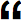

Relay
=====

    ------->
    P      S 
    <-------  

_Publish. Subscribe. Webhook. Syndicate._

Core specification
------------------

Relay - a protocol for syndicating content following a publish / subscribe and
webhook pattern.

* __Status:__ DRAFT
* __Latest Published Version:__
    *  Long Version:  https://github.com/aogriffiths/relay/blob/spec-published/relay-specification.md
    *  Short Version: https://github.com/aogriffiths/relay/blob/spec-published/relay-specification-short.md
*  __Latest Editor's Draft:__
    *  Long Version:  https://github.com/aogriffiths/relay/blob/spec-master/relay-specification.md
    *  Short Version: https://github.com/aogriffiths/relay/blob/spec-master/relay-specification-short.md
*  __Editor(s):__ 
    *  Adam Griffiths
* __See Also:__ https://github.com/aogriffiths/relay/blob/spec-master/README.md

Long versions includes examples and useful extracts from the PubSubHubbub
specification. Short versions omit these and other non-normative information.

The Published versions are official approved releases of the specification.
The Editor's Draft is the latest _work in progress_ version.

If you are implementing Relay or would find background and examples useful
read the long versions. If you are only looking for the normative parts of the
specifications or to see how simple the specification really is, read the
short versions.

 
************************************************************************************************************************
Abstract
------------------------------------------------------------------------------------------------------------------------

This document specifies "Relay" - a protocol for syndicating content following a
publish / subscribe and webhook pattern.

 
************************************************************************************************************************
Introduction
------------------------------------------------------------------------------------------------------------------------

Relay is inspired by and compatible with PubSubHubbub (PuSH). It also has
additional features and extensions that you might find useful. Any relay server 
can be made capable of being a Publisher, a Subscriber, a Hub or all three
and content is "_relayed_" between them.

The main difference to PuSH is that Relay requires Publishers publish 
content following the same protocol as Hubs use to distribute content. In other
words a Publisher sends content to a Hub in exactly the same way as a Hub sends
content to a Subscriber. The benefits are:

* __Simplicity:__ All content is sent between Publishers, Subscribers and Hubs 
  using the same protocol.
* __Compatibility:__ Relay is compatible with PuSH v0.4.
*  __Relaying:__ A chain of Hubs can be created for "_relaying_" content. This
  can be useful for distributing load or creating a proxy or / reverse proxy 
  Hub between Publishers and Subscribers.

 

************************************************************************************************************************
1. Notation and Conventions
------------------------------------------------------------------------------------------------------------------------

The key words "MUST", "MUST NOT", "REQUIRED", "SHALL", "SHALL NOT", "SHOULD",
"SHOULD NOT", "RECOMMENDED", "MAY", and "OPTIONAL" in this document are to be
interpreted as described in [RFC2119](http://www.ietf.org/rfc/rfc2119.txt).

Normative sections of this document are prescriptive parts of the specification.
Informative sections are non-normative and although not part of the prescriptive
specification they provide additional useful information (e.g. introduction,
fragments of other specifications and examples.)

 

************************************************************************************************************************
2. Definitions
------------------------------------------------------------------------------------------------------------------------

### Specific Definitions 
###### Normative:

* __PuSH:__ When the word "push" is capitalised as "PuSH" it refers to
  PubSubHubbub, and unless otherwise specified, version 0.4.
* __Topic/Feed:__ The words "feed" and "topic" are used interchangeably. A Topic
  is the unit to which one can subscribe to. It is a collection of entries.
* __Entry/Item:__ A topic is a collection of entries (synonymous with a feed
  being a collection of items).
* __Publisher:__ (_noun_). An entity that sends notifications of Changes to a
  Topic.
* __Originating Publisher:__ (_noun_). The Publisher entity that owns a Topic.
  They are the originating source and the only system where changes to
  the topic and it's entries can be authored.
* __To Publish:__ (_verb_). The process of notifying subscribers of changes to a
  Topic. The originating Publisher MUST _publish_ the Topic using the Relay
  specification. Other systems that Subscribe to the Topic MAY  re-_publish_ it,
  in which case they are acting as a Hub. 
* __To Distribute:__ (_verb_). Synonymous with "to re-publish". The concept of
  a Hub distributing content is introduced in PuSH and referred to in the Relay 
  specification.
* __Subscriber:__ (_noun_). An entity that receives notifications of changes to
  a Topic.
* __To Subscribe:__ (_verb_). The process of requesting a changes to a Topic are
  distributed to a Subscriber on an on going basis. 
* __Hub:__ An entity that both subscribers to a Topic and re-publishes it. The Hub
  effectively "_relays_" the Topic.

### General Concepts 
###### Informative:

1. All Relay Publishers are their own Hubs. 
2. A Publisher follows the same approach to _publishing_ content as a Hub
   follows for _distributing_ it. 
3. Hubs subscribe to Publishers.
4. Subscribers subscribe to Hubs.
5. Hubs can subscribe to other Hubs to create a chain of Hubs.

 

************************************************************************************************************************
3. High-level protocol flow 
------------------------------------------------------------------------------------------------------------------------
###### Informative:

The protocol for Relay follows the protocol PuSH and is outlined in sections 4
to 8. (See also section 3 of the PuSH v0.4 specification and note Section 3 to 8
of this specification broadly map to sections 3 to 8 of the PuSH v0.4
specification.)

<!-- Long Spec START -->  
The following information is non-normative but serves as an overview of the
protocol and index to sections 4 to 8.

* __[4. Discovery ](#4.)__ - A Subscriber discovers a Topic from a Publisher
  and how to subscribe to it.

* __[5. Subscription ](#5.)__ - The Subscriber subscribes to the Topic to
  receive notification when it changes.
    * __[5.1. Subscription Request ](#5.1.)__ - The Subscriber sends a 
      Subscription Request to a Hub. 
    * __[5.2. Subscription Validation ](#5.2.)__ - The Hub validates the 
      Subscription Request.
    * __[5.3. Subscriber Verification ](#5.3.)__ - The Hub verifies the intent 
      of the Subscriber.
    * __[5.4. Subscription Renewall](#5.4.)__ - The Hub periodically confirms 
      with the Subscriber to check if the subscription is still required.
    * __[5.5. Subscription Denial ](#5.5.)__ - The Hub informs the Subscriber 
      that the subscription has been denied and is not (or no longer) active.

* __[6. Publishing ](#6.)__ - Publishers POST any topic changes to their 
  subscriber(s) (which many be Hubs). 

* __[7. Content Distribution ](#7.)__ - When Hubs receive
  POSTed Topic changes the POST them on to their subscriber(s), which many also
  be Hubs, so the chain continues until all Hubs and Subscribers are reached.
  (_Publishing and Relay-Publishing are done in an identical way and follow the
  PusH specification part 7_)

* __[8. Authenticated Content Distribution ](#8.)__ - 

#### PuSH Specification
###### Informative:

> 3\. High-level protocol flow

> (This section is non-normative.)

> Publishers notify their hub(s) URLs when their topic(s) change. Subscribers
> POST to one or more of the advertised hubs for a topic they're interested in.
> Alternatively, some hubs may offer auto-polling capability, to let {their,any}
> subscribers subscribe to topics which don't advertise a hub. The hub caches
> minimal metadata (id, data, entry digest) about each topic's previous state.
> When the hub re-fetches a topic feed (on its own initiative or as a result of
> a publisher's ping) and finds a delta, it enqueues a notification to all
> registered subscribers.

<!-- Long Spec END -->

 
<a name="4.">
************************************************************************************************************************
4. Discovery
------------------------------------------------------------------------------------------------------------------------

_The Subscriber discovers which Hub(s) a Publisher is using_

###### Normative:

1. Adhere to section 4. "Discovery" in the PuSH v0.4 specification.

2.  
   __Topic URLS:__ The URL from which the topic is retrieved during discovery 
   SHOULD be referred to as the "requested_topic_url". The the self link header
   returned (with rel=self) SHOULD be referred to as the
   "advertised_topic_url". Generally the requested_topic_url and the
   advertised_topic_url will be the same and are jointly be referred to as the
   "topic_url" in the Relay and PuSH specifications. If there is any ambiguity,
   topic_url MUST be assumed to mean the advertised_topic_url when one is
   available and the requested_topic_url when there is not. In effect this means
   the advertised_topic_url overrides the requested_topic_url.

3. __Hub Links:__ There MAY be more than one hub link header (with rel=hub). If 
   so Subscribers MAY subscriber to one or more Hub. Subscribing to one is
   RECOMMENDED and Subscribers SHOULD use the first first hub link provided
   unless there is a reason not to. Publishes SHOULD put their preferred hub
   first in the order of hub link headers. The selected Hub URL SHOULD be
   referred to as the "advertised_hub_url". (If there were several Hubs advertised 
   this might more accurately be called the selected_hub_url_from_the_advertised_urls
   but this documentation abbreviates it to just the advertised_hub_url.)

4. __Publisher's Own Hub:__ Relay requires all Publishers MUST be capable of 
   being their own hub. It is therefore RECOMMENDED that at least one hub link
   header returned by a Publisher is their own Hub URL. Publishers MAY choose
   not to do this if they are no longer accepting direct subscriptions but MUST
   always return at least one Hub URL, referring to a Hub that they are
   actively distributing content to.

5. __Publishers Fall Back:__ Relay Publishers MAY OPTIONALLY provide the other
   methods methods of discovery refereed to in the PuSH 0.3 and PuSH 0.4
   specification. However this is NOT REQUIRED to support Relay and should only
   be considered for supporting PuSH 0.3 Subscribers.

6. __Subscriber Fall Back:__ Relay Subscribers MAY OPTIONALLY fall back to
   alternative methods of discovery. However this is NOT REQUIRED to support
   Relay or PuSH 0.4 Publishers and should only be considered for
   supporting PuSH 0.3 Publishers.

 

************************************************************************************************************************
5. Subscribing and Unsubscribing
------------------------------------------------------------------------------------------------------------------------

_The Subscriber subscribes to a Hub for a Topic_

###### Normative:

1. Adhere to section 5. "Subscribing and Unsubscribing" in the PuSH 0.4 specification

 

************************************************************************************************************************
### 5.1. Subscription Request

_The Subscriber sends a Subscription Request to a Hub_

###### Normative:

1. Adhere to sections 5.1, 5.1.1 and 5.1.2 "Subscriber 
   Sends Subscription Request" in the PuSH v0.4 specification.

2. The topic URL (hub.topic) MUST be the advertised_topic_url as defined in 
   [section 4 point 2](#4.2). The hub URL mus

   TODO...

3. 
   A well formed subscription request MUST meet the following criteria:
    * `hub.callback` is present and is a valid URL 
    * `hub.mode` is present and is either "subscribe" or "unsubscribe". If it is
        "unsubscribe" the Hub MUST have an existing subscription for the given tuple 
        {hub.topic, hub.callback}.
    * `hub.topic` is present and is one the Hub is able to distribute. 
        This means the Hub is either already subscribing to this topic or the Hub
        is willing to "auto subscribe" and set up a new subscription to this
        topic.

4. A well formed subscription request MAY meet the following criteria:
    * `hub.lease_seconds` is present and is a number
    * `hub.secret` is present and is alphanumeric

 

************************************************************************************************************************
### 5.2. Subscription Validation 

_The Hub validates the Subscription Request_

###### Normative:

1. Adhere to section 5.2 "Subscription Validation" in the PuSH v0.4 specification.

2. Validation SHOULD include the hub checking the subscription request is well 
   formed as defined in [section 5.1 point 3](#5.1.3) of this specification.

3. Validation MAY include ensuring the subscriber or publisher have not 
   been blacklisted and the Hub is "willing" to maintain the new subscription
   that is being requested.

4. If (and when) validation succeeds (the subscription is accepted) the hub MUST 
   complete the Verification step. See [section 5.3](#5.3) of this specification.

5. If (and when) validation fails (the subscription is denied) the hub MUST 
   complete the Denial step. See [section 5.5](#5.5) of this specification.

6. The Hub MAY integrate with the original Publisher for further validation of 
   the subscription. This specification does not recommend how that is done but
   an approach may be specified in a suitable a relay extension. (However it 
   is worth noting that after a Publisher distributes content to a Hub is 
   technically cannot mandate what the Hub does with that content afterwards.
   Fair use or contractual policies may go some way to addressing this but 
   Publishers should only distribute content to Hubs that they trust.)

 

************************************************************************************************************************
### 5\.3\. Subscriber Verification

_The Publisher verifies the intent of the Subscriber_

###### Normative:

1. Adhere to section 5.3 "Hub Verifies Intent of the Subscriber" in the PuSH 
   v0.4 specification.

 

************************************************************************************************************************
### 5.4. Subscription Renewal

_The Subscriber sends a Subscription Request to a Hub_

1. Subscriber is given a number of `lease_seconds` and MUST resubscribe before
   these have elapsed.

2. Re-subscription follows exactly the same steps as the initial subscription.

 

************************************************************************************************************************
### 5.5. Subscription Denial

_Hub informs the Subscriber when a subscription is denied_

###### Normative:

1. TODO

 

************************************************************************************************************************
6. Publishing
------------------------------------------------------------------------------------------------------------------------

_The Publisher sends updates to it's Hubs and any other Subscribers_

###### Normative:

1. Adhere to section 6 "Publishing" of the PuSH v0.4 specification.

TODO 

2. Adhere to section 3 "High-level protocol flow" in the PuSH v0.4 specification.
   Specifically MUST adhere to the first bullet. MAY NOT adhere to the third bullet (
   which is acceptable given section 6 "Publishing" in the PuSH v0.4 specification).

TODO

3. PuSH leaves it open as to how a Publisher sends content to a Hub. However with Relay
   Publishers and Hubs MUST both send their content to their Subscribers in an
   identical way. See section [5. Subscribing and Unsubscribing](#5.) and 
   section [7. Content Distribution]#(7.) of this specification of how that is done.

  
************************************************************************************************************************
7. Content Distribution
------------------------------------------------------------------------------------------------------------------------

_Hub sends updates to Subscribers and any other Hubs_

###### Normative:

1. Adhere to section 7 "Content Distribution" of the PuSH v0.4 specification.

  
************************************************************************************************************************
8. Authenticated Content Distribution
------------------------------------------------------------------------------------------------------------------------

_TODO_

###### Normative:

1. Adhere to section 8 "Authenticated Content Distribution" of the PuSH v0.4 specification.

************************************************************************************************************************
References
------------------------------------------------------------------------------------------------------------------------

* [PubSubHubbub Core 0.4 -- Working Draft]
  (https://pubsubhubbub.googlecode.com/git/pubsubhubbub-core-0.4.html)
* RFC4287  Nottingham, M., Ed. and R. Sayre, Ed., [The Atom Syndication Format]
  (http://www.ietf.org/rfc/rfc4287.txt)

