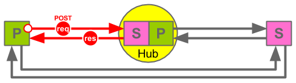
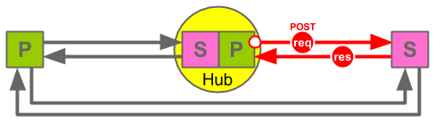

Relay
=====

_Publish. Subscribe. Webhook. Syndicate._

    ------->
    P      S 
    <-------  

Core specification
------------------

* Relay - A protocol for syndicating content using a publish subscribe pattern.
* __Status:__ DRAFT
* __Latest Published Version:__
    *  __Long Version:__ [https://github.com/aogriffiths/relay/blob/spec-published/relay-specification.md]
    *  __Short Version:__ [https://github.com/aogriffiths/relay/blob/spec-published/relay-specification-short.md]
*  __Latest Editor's Draft:__
    *  __Long Version:__ [https://github.com/aogriffiths/relay/blob/spec-master/relay-specification.md]
    *  __Short Version:__ [https://github.com/aogriffiths/relay/blob/spec-master/relay-specification-short.md]
*  __Editor(s):__ 
    *  Adam Griffiths
* __See Also:__ [https://github.com/aogriffiths/relay/blob/spec-master/README.md]

Long versions includes examples and useful extracts from the PubSubHubbub
specification. Short versions omit these and other non-normative information.

The Published versions are official approved releases of the specification. The
Editor's Draft is the latest _work in progress_ version.

If you are implementing Relay or would find background and examples useful read
the long versions. If you are only looking for the normative parts of the
specifications or to see how simple the specification really is, read the short
versions.

 
************************************************************************************************************************
Abstract
------------------------------------------------------------------------------------------------------------------------

This document specifies "Relay", a protocol for syndicating content following
the  publish / subscribe and webhook patterns.

 
************************************************************************************************************************
Introduction
------------------------------------------------------------------------------------------------------------------------

Relay is inspired by and compatible with PubSubHubbub (PuSH) but also offers 
additional features and extensions that you might find useful. Relay considers
any server to be capable of being a Publisher, a Subscriber, a Hub or all three
and content can be "_relayed_" from the Publisher to Subscribers
directly or via one or more Hubs.

<!-- Long Spec START -->
What does this mean? A picture is worth a thousand words:

<!-- Long Spec END -->

The main difference to PuSH is that Relay requires all Publishers publish 
their content using the same protocol as Hubs use to distribute content.  
In other words a Publisher sends content to a Hub in exactly the same way as a 
Hub sends content to a Subscriber. The benefits are:

* __Simplicity:__ All content is sent between Publishers, Subscribers and Hubs 
  using the same protocol.
* __Compatibility:__ Relay is compatible with PuSH v0.4.
* __Relaying:__ A chain of Hubs can be created for "_relaying_" content, which 
  can be useful for distributing load or moving content from within a private
  network, using a private Hub, to the public Internet, using a public Hub.

 

************************************************************************************************************************
1. Notation and Conventions
------------------------------------------------------------------------------------------------------------------------

The key words "MUST", "MUST NOT", "REQUIRED", "SHALL", "SHALL NOT", "SHOULD",
"SHOULD NOT", "RECOMMENDED", "MAY", and "OPTIONAL" in this document are to be
interpreted as described in [RFC2119](http://www.ietf.org/rfc/rfc2119.txt).

 

************************************************************************************************************************
2. Definitions
------------------------------------------------------------------------------------------------------------------------

### Specific Definitions

* __PuSH:__ When the word "push" is capitalised as "PuSH" it refers to
  PubSubHubbub, and unless otherwise specified, version 0.4.
* __Topic/Feed:__ The words "feed" and "topic" are used interchangeably. A Topic
  is the unit to which one can subscribe to. It is a collection of entries.
* __Entry/Item:__ A topic is a collection of entries (Synonymous with a feed
  being a collection of items).
* __Publisher:__ (_noun_). An entity that sends notifications of Changes to a
  Topic.
* __Originating Publisher:__ (_noun_). The Publisher entity that owns a Topic.
  They are the originating source and the only system where changes to
  the topic and it's entries can be authored.
* __To publish:__ (_verb_). The process of notifying subscribers of changes to a
  Topic. The originating Publisher MUST _publish_ the Topic using the Relay
  specification. Other systems MAY also re-_publish_ the Topic, in which case
  they are acting as a Hub.
* __Subscriber:__ (_noun_). An entity that receives notifications of changes to
  a Topic.
* __To subscribe:__ (_verb_). The process of requesting a Publisher publishes to
  a Subscriber on an on going basis. Usually initiated by the subscriber.
* __Hub:__ An entity that both subscribers to a Topic and publishes it. A Hub
  re-publishes ("_relays_") a Topic.

### General Concepts

* All Relay Publishers are their own Hubs. 
* A Publisher follows the same approach to _publishing_ content as a Hub
follows for _distributing_ it. PuSH uses "publishing" and "distributing" to
refer to slightly different things but Relay seeks to make them the same
thing.
* Hubs subscribe to Publishers or other Hubs.
* Subscribers subscribe to Hubs or Publishers.

 

************************************************************************************************************************
3. High-level protocol flow
------------------------------------------------------------------------------------------------------------------------

The protocol for Relay following the protocol PuSH and is outlined in sections
4 to 7 of this specification.

<!-- Long Spec START --> 
The following information is non-normative but serves
as an overview of the protocol and index to sections 4 to 7 in this specification.

* __[4. Discovery ](#4.)__ - A Subscriber discovers a Topic from a Publisher
  and how to subscribe to it.

* __[5. Subscription ](#5.)__ - The Subscriber subscribes to the Topic to
  receive notification when it changes.
    * __[5.1. Subscription Request ](#5.1.)__ - The Subscriber sends a 
      Subscription Request to a Hub. 
    * __[5.2. Subscription Validation ](#5.2.)__ - The Hub validates the 
      Subscription Request.
    * __[5.3. Subscriber Verification ](#5.3.)__ - The Hub verifies the intent of
      the Subscriber.
    * __[5.4. Subscription Renewall](#5.4.)__ - The Hub periodically confirms 
      with the Subscriber to check if the subscription is still required.
    * __[5.5. Subscription Denial ](#5.5.)__ - The Hub informs the Subscriber that
      the subscription has been denied and is not (or no longer) active.

* __[6. Publishing ](#6.)__ - Publishers POST any topic changes to their subscriber(s)
  (which many be Hubs). 

* __[7. Content Distribution ](#7.)__ - When Hubs receive
  POSTed Topic changes the POST them on to their subscriber(s), which many also
  be Hubs, so the chain continues until all Hubs and Subscribers are reached.
  (_Publishing and Relay-Publishing are done in an identical way and follow the
  PusH specification part 7_)

* __[8. Authenticated Content Distribution ](#8.)__ - 

<!-- Long Spec END -->

<!-- Long Spec START -->
#### PuSH Specification

> 3\. High-level protocol flow

> (This section is non-normative.)

> Publishers notify their hub(s) URLs when their topic(s) change. Subscribers POST
> to one or more of the advertised hubs for a topic they're interested in.
> Alternatively, some hubs may offer auto-polling capability, to let {their,any}
> subscribers subscribe to topics which don't advertise a hub. The hub caches
> minimal metadata (id, data, entry digest) about each topic's previous state.
> When the hub re-fetches a topic feed (on its own initiative or as a result of a
> publisher's ping) and finds a delta, it enqueues a notification to all
> registered subscribers.

<!-- Long Spec END -->

 
<a name="4.">
************************************************************************************************************************
4. Discovery
------------------------------------------------------------------------------------------------------------------------
_The Subscriber discovers from a Publisher the Hub(s) which it is publishing to._

<!-- Long Spec START -->

<!-- Long Spec END -->

<!-- Long Spec START -->
#### PuSH Specification

> 4\. Discovery

> A potential subscriber initiates discovery by retrieving (GET or HEAD
> request) the topic to which it wants to subscribe. The HTTP [RFC2616]
> response from the publisher MUST include at least one Link Header [RFC5988]
> with rel=hub (a hub link header) as well as exactly one Link Header
> [RFC5988] with rel=self (the self link header). The former MUST indicate the
> exact URL of a PubSubHubbub hub designated by the publisher. If more than
> one URL is specified, it is expected that the publisher pings each of these
> URLs, so the subscriber may subscribe to one or more of these. The latter
> will point to the permanent URL for the resource being polled.

> In the absence of HTTP [RFC2616] Link headers, subscribers MAY fall back to
> other methods to discover the hub(s) and the canonical URI of the topic. If
> the topic is an XML based feed, it MAY use embedded link elements as
> described in Appendix B of Web Linking [RFC5988]. Similarly, for HTML pages,
> it MAY use embedded link elements as described in Appendix A of Web Linking
> [RFC5988]. Finally, publishers MAY also use the Well-Known Uniform Resource
> Identifiers [RFC5785] .host-meta to include the <Linkelement with rel="hub".

#### Relay Specification
<!-- Long Spec END -->

1. Adhere to section 4. "Discovery" in the PuSH v0.4 specification.

2.  
   __Topic URLS:__ The URL from which the topic is retrieved during discovery 
   SHOULD be referred  to as the "requested_topic_url". The the self link header
   returned (with  rel=self) SHOULD be referred to as the
   "advertised_topic_url". Generally the requested_topic_url and the
   advertised_topic_url will be the same and are jointly be referred to as the
   "topic_url" in the Relay and PuSH specifications. If there is any ambiguity,
   topic_url MUST be assumed to mean the advertised_topic_url when one is
   available and the requested_topic_url when there is not. In effect this means
   the advertised_topic_url overrides the requested_topic_url.

3. __Hub Links:__ There MAY be more than one hub link header (with rel=hub). If 
   so Subscribers MAY subscriber to one or more Hub. Subscribing to one is
   RECOMMENDED and Subscribers SHOULD use the first first hub link provided
   unless there is a reason not to. Publishes SHOULD put their preferred hub
   first in the order of hub link headers. The selected Hub URL SHOULD be
   referred to as the "advertised_hub_url". (If there were several Hubs advertised 
   this might more accurately be called the selected_hub_url_from_the_advertised_urls
   but this documentation abbreviates it to just the advertised_hub_url!)

4. __Publisher's Own Hub:__ Relay requires all Publishers MUST be capable of 
   being their own hub. It is therefore RECOMMENDED that at least one hub link
   header returned by a Publisher is their own Hub URL. Publishers MAY choose
   not do do this if they are no longer accepting direct subscriptions but MUST
   always return at least one Hub URL, referring to a Hub that they are
   actively distributing content to.

5. __Publishers Fall Back:__ Relay Publishers MAY OPTIONALLY provide the other
   methods methods of discovery refereed to in the PuSH 0.3 and PuSH 0.4
   specification. However this is NOT REQUIRED to support Relay and should only
   be considered for supporting PuSH 0.3 Subscribers.

6. __Subscriber Fall Back:__ Relay Subscribers MAY OPTIONALLY fall back to
   alternative methods of discovery. However this is NOT REQUIRED to support
   Relay or PuSH 0.4 Publishers and should only be considered for
   supporting PuSH 0.3 Publishers.

<!-- Long Spec START -->
#### Examples (Non-normative)

(See diagram above.)

 Subscriber makes a GET or HEAD request to Publisher for a topic.
    
    HEAD <requested_topic_url> HTTP/1.1
    Host: <hostname.com>

 Publisher responds to Subscriber with suitable headers. (If it were 
a GET request the Publisher MAY also include a recent version of the the top few Entries 
in the Topic.)

    HTTP/1.1 200 OK
    Content-Type: text/xml; charset=utf-8
    Content-Length: length
    Link: <advertised_hub_url>; rel=hub, <advertised_topic_url>; rel=self

#### Reference Implementation

__requested_topic_url & advertised_topic_url__ MAY be any URL:

    [https|http]://<domain>/path

e.g.

    https://example.com/content_feeds/breaking_news

__advertised_hub_url__  SHOULD end with `/relay/hub`

    [https|http]://<hub_domain>/relay/hub

e.g.

    https://example.com/relay/hub
    

<!-- Long Spec END -->

 

************************************************************************************************************************
5. Subscribing and Unsubscribing
------------------------------------------------------------------------------------------------------------------------
<!-- Long Spec START -->
#### PuSH Specification

> 5\. Subscribing and Unsubscribing

> Subscribing to a topic URL consists of four parts that may occur immediately 
> in sequence or have a delay.

> * Requesting a subscription using the hub
> * Validating the subscription with the publisher (OPTIONAL)
> * Confirming the subscription was actually desired by the subscriber
> * Periodically reconfirming the subscription is still active (OPTIONAL)

> Unsubscribing works in the same way, except with a single parameter changed 
> to indicate the desire to unsubscribe. Also, the Hub will not validate 
> unsubscription requests with the publisher.

#### Relay Specification
<!-- Long Spec END -->

1. Adhere to section 5. "Subscribing and Unsubscribing" in the PuSH 0.4 specification

2. (non-normative) The following notes are useful if you wish to read the Relay 
   specification in conjunction with the PuSH specification:
   * Sections 5.1, 5.2, 5.3 and 5.4 in this specification map to the four bullets in 
     section 5 of the PuSH 0.4 specification. 
   * Sections 5.1, 5.2, 5.3 in this specification relate to sections of the same 
     numbers in the PuSH 0.4 specification. 
   * Section 5.4 in this specification describes subscription reconfirming / renewal, 
     of a subscription which is mentioned in various places in the PuSH 0.4 specification. 
   * Section 5.5 in this specification describes subscription
     denying, which is referred to in section 5.2 of the PuSH 0.4 specification.

 

************************************************************************************************************************
### 5.1. Subscription Request

_The Subscriber sends a Subscription Request to a Hub_

<!-- Long Spec START -->

<!-- Long Spec END -->

<!-- Long Spec START -->
#### PuSH Specification

> 5\.1\.  Subscriber Sends Subscription Request
>
> Subscription is initiated by the subscriber making an HTTPS [RFC2616] or
> HTTP [RFC2616] POST request to the hub URL. This request has a Content-Type
> of application/x-www-form-urlencoded (described in Section 17.13.4 of
> [W3C.REC‑html401‑19991224]) and the following parameters in its body:
>
> * __hub.callback__ REQUIRED. The subscriber's callback URL where
>   notifications should be delivered. It is considered good practice to use a
>   unique callback URL for each subscription.
> * __hub.mode__ REQUIRED. The literal string "subscribe" or "unsubscribe",
>   depending on the goal of the request.
> * __hub.topic__ REQUIRED. The topic URL that the subscriber wishes to
>   subscribe to or unsubscribe from.
> * __hub.lease_seconds__ OPTIONAL. Number of seconds for which the subscriber
>   would like to have the subscription active. Hubs MAY choose to respect
>   this value or not, depending on their own policies. This parameter MAY be
>   present for unsubscription requests and MUST be ignored by the hub in that
>   case.
> * __hub.secret__ OPTIONAL. A subscriber-provided secret string that will be
>   used to compute an HMAC digest for authorized content distribution. If not
>   supplied, the HMAC digest will not be present for content distribution
>   requests. This parameter SHOULD only be specified when the request was
>   made over HTTPS [RFC2818]. This parameter MUST be less than 200 bytes in
>   length.
>
> Subscribers MAY also include additional HTTP [RFC2616] request parameters, as
> well as HTTP [RFC2616] Headers if they are required by the hub. In the
> context of social web applications, it is considered good practice to include
> a From HTTP [RFC2616] header (as described in section 14.22 of Hypertext
> Transfer Protocol [RFC2616]) to indicate on behalf of which user the
> subscription is being performed.
> 
> Hubs MUST ignore additional request parameters they do not understand.
>
> Hubs MUST allow subscribers to re-request subscriptions that are already
> activated. Each subsequent request to a hub to subscribe or unsubscribe MUST
> override the previous subscription state for a specific topic URL and
> callback URL combination once the action is verified. Any failures to
> confirm the subscription action MUST leave the subscription state unchanged.
> This is required so subscribers can renew their subscriptions before the
> lease seconds period is over without any interruption.
>
> 5\.1\.1\.  Subscription Parameter Details
> 
> The topic and callback URLs MAY use HTTP [RFC2616] or HTTPS [RFC2818]
> schemes. The topic URL MUST be the one advertised by the publisher in a Self
> Link Header during the discovery phase. (See Section 4). Hubs MAY refuse
> subscriptions if the topic URL does not correspond to the one advertised by
> the publisher. The topic URL can otherwise be free-form following the URI
> spec [RFC3986]. Hubs MUST always decode non-reserved characters for these
> URL parameters; see section 2.4 on "When to Encode or Decode" in the URI
> spec [RFC3986].
>
> The callback URL MAY contain arbitrary query string parameters (e.g.,
> ?foo=bar&red=fish). Hubs MUST preserve the query string during subscription
> verification by appending new parameters to the end of the list using the &
> (ampersand) character to join. Existing parameters with names that overlap
> with those used by verification requests will not be overwritten. For event
> notification, the callback URL will be POSTed to including any query-string
> parameters in the URL portion of the request, not as POST body parameters.
>
> 5\.1\.2\.  Subscription Response Details
>
> The hub MUST respond to a subscription request with an HTTP [RFC2616] 202
> "Accepted" response to indicate that the request was received and will now
> be verified (Section 5.3) and validated (Section 5.2) by the hub. The hub
> SHOULD perform the verification and validation of intent as soon as
> possible.
>
> If a hub finds any errors in the subscription request, an appropriate HTTP
> [RFC2616] error response code (4xx or 5xx) MUST be returned. In the event of
> an error, hubs SHOULD return a description of the error in the response body
> as plain text. Hubs MAY decide to reject some callback URLs or topic URLs
> based on their own policies (e.g., domain authorization, topic URL port
> numbers).

#### Relay Specification
<!-- Long Spec END -->

1. Adhere to sections 5.1, 5.1.1 and 5.1.2 "Subscriber 
   Sends Subscription Request" in the PuSH v0.4 specification.

2. The topic URL (hub.topic) MUST be the advertised_topic_url as defined in 
   [section 4 point 2](#4.2) of this specification. The hub URL mus

3. 
   A well formed subscription request MUST meet the following criteria:
    * `hub.callback` is present and is a valid URL 
    * `hub.mode` is present and is either "subscribe" or "unsubscribe". If it is
        "unsubscribe" the Hub MUST have an existing subscription for the given tuple 
        {hub.topic, hub.callback}.
    * `hub.topic` is present and is one the Hub is able to distribute. 
        This means the Hub is either already subscribing to this topic or the Hub
        is willing to "auto subscribe" and set up a new subscription to this
        topic.

4. A well formed subscription request MAY meet the following criteria:
    * `hub.lease_seconds` is present and is a number
    * `hub.secret` is present and is alphanumeric

<!-- Long Spec START -->

#### Examples

(See diagram above.)

 Subscriber makes a POST request to the Publisher's hub URL.

    POST <advertised_hub_url> HTTP/1.1
    Content-Type: application/x-www-form-urlencoded

    hub.callback=<subscriber_callback_url>&hub.mode=subscribe&hub.topic=
      <advertised_topic_url>&hub.lease_seconds=<lease_seconds>&hub.secret=<secret>

 Publisher response (success):

    HTTP/1.1 202 Accepted

 Publisher response (failure):

    HTTP/1.1 400 Bad Request

This is an example and error codes could be any 4xx or 5xx.

#### Reference Implementation

__subscriber_callback_url:__ 

The subscriber callback url is under `/relay/callback/`

    [https|http]://<subscriber_domain>/relay/callback/<unique_string>

Where `unique_string` is a string that is unique to the subscriber domain. 200
characters long and alphanumeric. (Having a long callback URL helps ensure it cannot 
be discovered by a brute force attack and the spammed or DDOS attacked.)

e.g.

    https://example.com/relay/callback/1234567890AbCdEfGhIj1234567890AbCdEfGh
       Ij1234567890AbCdEfGhIj1234567890AbCdEfGhIj1234567890AbCdEfGhIj
    

<!-- Long Spec END -->

 

************************************************************************************************************************
### 5.2. Subscription Validation 

_The Hub validates the Subscription Request_

<!-- Long Spec START -->

<!-- Long Spec END -->

<!-- Long Spec START -->
#### PuSH Specification

 

> 5\.2\.  Subscription Validation
>
> Subscriptions MAY be validated by the Hubs who may require more details to
> accept or refuse a subscription. The Hub MAY also check with the publisher
> whether the subscription should be accepted.
>
> If (and when), the subscription is accepted, the hub MUST perform the
> verification of intent of the subscriber.
>
> If (and when), the subscription is denied, the hub MUST inform the
> subscriber by sending an HTTP [RFC2616] GET request to the subscriber's
> callback URL as given in the subscription request. This request has the
> following query string arguments appended (format described in Section
> 17.13.4 of [W3C.REC‑html401‑19991224]):
>
> * __hub.mode__ REQUIRED. The literal string "denied".
> * __hub.topic__ REQUIRED. The topic URL given in the corresponding 
>   subscription request.
> * __hub.reason__ OPTIONAL. The hub may include a reason for which the 
>   subscription has been denied.
>
> Hubs may provide an additional HTTP [RFC2616] Location header (as described
> in section 14.30 of Hypertext Transfer Protocol [RFC2616]) to indicate that
> the subscriber may retry subscribing to a different hub.topic. This allows
> for limited distribution to specific groups or users in the context of
> social web applications.
>
> The subscription MAY be denied by the hub at any point (even if it was
> previously accepted). The Subscriber SHOULD then consider that the
> subscription is not possible anymore.

#### Relay Specification
<!-- Long Spec END -->

1. Adhere to section 5.2 "Subscription Validation" in the PuSH v0.4 specification.

2. Validation SHOULD include the hub checking the subscription request is well 
   formed as defined in [section 5.1 point 3](#5.1.3) of this specification.

3. Validation MAY include ensuring the subscriber or publisher have not 
   been blacklisted and the Hub is "willing" to maintain the new subscription
   that is being requested.

4. If (and when) validation succeeds (the subscription is accepted) the hub MUST 
   complete the Verification step. See [section 5.3](#5.3) of this specification.

5. If (and when) validation fails (the subscription is denied) the hub MUST 
   complete the Denial step. See [section 5.5](#5.5) of this specification.

6. The Hub MAY integrate with the original Publisher for further validation of 
   the subscription. This specification does not recommend how that is done but
   an approach may be specified in a suitable a relay extension. (However it 
   is worth noting that after a Publisher distributes content to a Hub is 
   technically cannot mandate what the Hub does with that content afterwards.
   Fair use or contractual policies may go some way to addressing this but 
   Publishers should only distribute content to Hubs that they trust.)

<!-- Long Spec START -->
#### Examples

(See diagram above.)

There are no specific http examples to provide here because the
protocol which the Hub should use to integrate with the Publisher for Validation
is not defined in this specification. The examples given in sections 5.1, 5.3 and 
5.4 and 5.5 cover all communication between the Hub and the Subscriber.

<!-- Long Spec END -->

 

************************************************************************************************************************
### 5\.3\. Subscriber Verification

_The Publisher verifies the intent of the Subscriber_

<!-- Long Spec START -->

<!-- Long Spec END -->

<!-- Long Spec START -->
#### PuSH Specification

> 5\.3\.  Hub Verifies Intent of the Subscriber
>
> In order to prevent an attacker from creating unwanted subscriptions on
> behalf of a subscriber (or unsubscribing desired ones), a hub must ensure
> that the subscriber did indeed send the subscription request.
>
> The hub verifies a subscription request by sending an HTTP [RFC2616] GET
> request to the subscriber's callback URL as given in the subscription
> request. This request has the following query string arguments appended
> (format described in Section 17.13.4 of [W3C.REC‑html401‑19991224]):
>
> * __hub.mode__ REQUIRED. The literal string "subscribe" or "unsubscribe",
>   which matches the original request to the hub from the subscriber.
> * __hub.topic__ REQUIRED. The topic URL given in the corresponding subscription
>   request.
> * __hub.challenge__ REQUIRED. A hub-generated, random string that MUST be echoed
>   by the subscriber to verify the subscription.
> * __hub.lease_seconds__ REQUIRED/OPTIONAL. The hub-determined number of seconds
>   that the subscription will stay active before expiring, measured from the
>   time the verification request was made from the hub to the subscriber. Hubs
>   MUST supply this parameter for subscription requests. This parameter MAY be
>   present for unsubscribe requests and MUST be ignored by subscribers during
>   unsubscription.
>
> 5\.3\.1\.  Verification Details
>
> The subscriber MUST confirm that the hub.topic corresponds to a pending
> subscription or unsubscription that it wishes to carry out. If so, the
> subscriber MUST respond with an HTTP success (2xx) code with a response body
> equal to the hub.challenge parameter. If the subscriber does not agree with
> the action, the subscriber MUST respond with a 404 "Not Found" response.
>
> The hub MUST consider other server response codes (3xx, 4xx, 5xx) to mean
> that the verification request has failed. If the subscriber returns an HTTP
> [RFC2616] success (2xx) but the content body does not match the
> hub.challenge parameter, the hub MUST also consider verification to have
> failed.
>
> Hubs MAY make the hub.lease_seconds equal to the value the subscriber passed
> in their subscription request but MAY change the value depending on the
> hub's policies. To sustain a subscription, the subscriber MUST re-request
> the subscription on the hub before hub.lease_seconds seconds has elapsed.

#### Relay Specification
<!-- Long Spec END -->

1. Adhere to section 5.3 "Hub Verifies Intent of the Subscriber" in the PuSH v0.4 specification.

<!-- Long Spec START -->
#### Examples

(See diagram above.)

 Hub makes a GET request to the Subscribers's callback URL.

    GET <subscriber_callback_url>?hub.mode=subscribe&hub.topic=<advertised_topic_url>&hub
      .challenge=<challenge_string>&hub.lease_seconds=604800 HTTP/1.1

 Subscriber response (success):

    HTTP/1.1 200 OK

    <challenge_string>

 Subscriber response (failiure):

    HTTP/1.1 404 Not Found
<!-- Long Spec END -->

 

************************************************************************************************************************
### 5.4. Subscription Renewal

_The Subscriber sends a Subscription Request to a Hub_

<!-- Long Spec START -->

<!-- Long Spec END -->

1. Subscriber is given a number of `lease_seconds` and MUST resubscribe before
   these have elapsed.

2. Re-subscription follows exactly the same steps as the initial subscription.

 

************************************************************************************************************************
### 5.5. Subscription Denial

_Hub informs the Subscriber when a subscription is denied_

<!-- Long Spec START -->

<!-- Long Spec END -->

<!-- Long Spec START -->
#### Relay Specification
<!-- Long Spec END -->

1. Adhere to section 5.2 "Subscription Validation" (third paragraph onwards) in the PuSH v0.4 specification.

<!-- Long Spec START -->
#### Examples

(See diagram above.)

 Hub makes a GET request to the Subscriber's callback 
URL.

    GET <subscriber_callback_url>?hub.mode=denied&hub.topic=<topic_url>&hub.
      reason=<reason> HTTP/1.1

 Subscriber response:

    HTTP/1.1 200 OK

The specification does not specify what the subscriber response should be. It
MAY be assumed the Subscriber can return any response and the Publisher
will ignore it.

<!-- Long Spec END -->

 

************************************************************************************************************************
6. Publishing
------------------------------------------------------------------------------------------------------------------------
_The Publisher sends updates to it's Hubs and any other Subscribers_

<!-- Long Spec START -->

<!-- Long Spec END -->

<!-- Long Spec START -->
#### PuSH Specification

> 6\.  Publishing
>
> The publisher MUST inform the hubs it previously designated when a topic has
> been updated. The hub and the publisher can agree on any mechanism, as long
> as the hub is eventually able send the updated payload to the subscribers.

#### Relay Specification
<!-- Long Spec END -->

1. Adhere to section 6 "Publishing" of the PuSH v0.4 specification.

2. Adhere to section 3 "High-level protocol flow" in the PuSH v0.4 specification.
   Specifically adhere to the first bullet (Publishers notify Hubs when Topics change) 
   but MAY NOT adhere to the third bullet regarding Hubs fetching a Topic feed from a 
   Publisher. With Relay the Publisher MUST POST Topic changes to the Hub, which is
   acceptable given section 6 "Publishing" in the PuSH v0.4 specification (which says 
   "The hub and the publisher can agree on any mechanism").

3. The mechanism that Relay requires is that Publishers send Topic changes to Hubs is identical 
   to how Hubs send Topic changes to Subscribers. Therefore section 
   5. Subscribing and Unsubscribing](#5.) and section [7. Content Distribution](#7.) of 
   this specification apply equally to Publishers as they do to Hubs.

<!-- Long Spec START -->
<!-- Long Spec END -->

<!-- Long Spec START -->
#### Examples

(See section [7. Content Distribution - Examples](#8.examples)
<!-- Long Spec END -->

 

************************************************************************************************************************
7. Content Distribution
------------------------------------------------------------------------------------------------------------------------

_Hub sends updates to Subscribers and any other Hubs_.

(Applies equally to _Publisher sends updates to Hubs and any direct Subscribers_.)

<!-- Long Spec START -->

<!-- Long Spec END -->

<!-- Long Spec START -->
#### PuSH Specification

 
> 7\.  Content Distribution
>
> A content distribution request is an HTTP [RFC2616] POST request from hub to
> the subscriber's callback URL with the payload of the notification. This
> request MUST have a Content-Type corresponding to the type of the topic. The
> hub MAY reduce the payload to a diff between two consecutive versions if its
> format allows it.
> 
> The request MUST include a Link Header [RFC5988] with rel=hub pointing to
> the Hub as well as a Link Header [RFC5988] with rel=self set to the topic
> that's being updated. The Hub SHOULD combine both headers into a single Link
> Header [RFC5988].
> 
> The successful response from the subscriber's callback URL MUST be an HTTP
> [RFC2616] success (2xx) code. The hub MUST consider all other subscriber
> response codes as failures; that means subscribers MUST NOT use HTTP
> redirects for moving subscriptions. The response body from the subscriber
> MUST be ignored by the hub. Hubs SHOULD retry notifications repeatedly until
> successful (up to some reasonable maximum over a reasonable time period).
> Subscribers SHOULD respond to notifications as quickly as possible; their
> success response code SHOULD only indicate receipt of the message, not
> acknowledgment that it was successfully processed by the subscriber.

#### Relay Specification
<!-- Long Spec END -->

1. Adhere to section 7 "Content Distribution" of the PuSH v0.4 specification.

<!-- Long Spec START -->

#### Examples

(See diagram above.)

Publisher Request:

    POST <subscriber_callback_url> HTTP/1.1
    Content-Type: <topic_content_type>
    Link: <hub_url>; rel=hub, <topic_url>; rel=self

Subscriber Response (success):

    HTTP/1.1 200 OK
<!-- Long Spec END -->

 

************************************************************************************************************************
8. Authenticated Content Distribution
------------------------------------------------------------------------------------------------------------------------
<!-- Long Spec START -->
#### PuSH Specification

 
> 8\.  Authenticated Content Distribution
>
> If the subscriber supplied a value for hub.secret in their subscription
> request, the hub MUST generate an HMAC signature of the payload and include
> that signature in the request headers of the content distribution request.
> The X-Hub-Signature header's value MUST be in the form sha1=signature where
> signature is a 40-byte, hexadecimal representation of a SHA1 signature
> [RFC3174]. The signature MUST be computed using the HMAC algorithm [RFC2104]
> with the request body as the data and the hub.secret as the key.
>
> When subscribers receive a content distribution request with the X-Hub-
> Signature header specified, they SHOULD recompute the SHA1 signature with
> the shared secret using the same method as the hub. If the signature does
> not match, subscribers MUST still return a 2xx success response to
> acknowledge receipt, but locally ignore the message as invalid. Using this
> technique along with HTTPS [RFC2818] for subscription requests enables
> simple subscribers to receive authenticated notifications from hubs without
> the need for subscribers to run an HTTPS [RFC2818] server.
>
> Please note however that this signature only ensures that the payload was
> not forged. Since the notification also includes headers, these should not
> be considered as safe by the subscriber, unless of course the subscriber
> uses HTTPS [RFC2818] callbacks.

 

#### Relay Specification
<!-- Long Spec END -->

TODO

************************************************************************************************************************
References
------------------------------------------------------------------------------------------------------------------------

* [PubSubHubbub Core 0.4 -- Working Draft]
  (https://pubsubhubbub.googlecode.com/git/pubsubhubbub-core-0.4.html)
* RFC4287  Nottingham, M., Ed. and R. Sayre, Ed., [The Atom Syndication Format]
  (http://www.ietf.org/rfc/rfc4287.txt)

