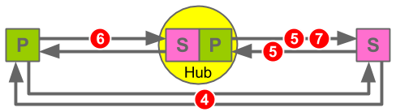
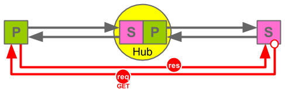
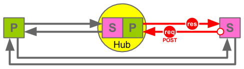

Relay
=====

    ------->
    P      S 
    <-------  

_Publish. Subscribe. Webhook. Syndicate._

Go to the [introduction](#intro) if you want to get straight to finding out how Relay works!

Document Status
---------------

Relay - a protocol for syndicating content following a publish / subscribe and
webhook pattern.

* __Status:__ DRAFT Version 0.1
* __Latest Published Version:__
    *  Long Version:  https://github.com/aogriffiths/relay/blob/spec-published/relay-specification.md
    *  Short Version: https://github.com/aogriffiths/relay/blob/spec-published/relay-specification-short.md
*  __Latest Editor's Draft:__
    *  Long Version:  https://github.com/aogriffiths/relay/blob/spec-master/relay-specification.md
    *  Short Version: https://github.com/aogriffiths/relay/blob/spec-master/relay-specification-short.md
*  __Editor(s):__ 
    *  Adam Griffiths
* __See Also:__ https://github.com/aogriffiths/relay/blob/spec-master/README.md

Long versions includes examples and useful extracts from the PubSubHubbub
specification. __Read these if you would find background and examples useful.__

Short versions omit these and other non-normative information. __Read the these
if you want to see how simple the specification really is.__

The Published versions are official approved releases of the specification. The
Editor's Draft is the latest _work in progress_ version.

 
************************************************************************************************************************
Abstract
------------------------------------------------------------------------------------------------------------------------

This document specifies "Relay" - a protocol for syndicating content following a
publish / subscribe and webhook pattern.

 

************************************************************************************************************************
Introduction (Informative)
------------------------------------------------------------------------------------------------------------------------

Relay is inspired by and compatible with PubSubHubbub (PuSH). They both provide
a protocol for Subscribers to subscribe to a Topic which is maintained by a
Publisher. Updates to the Topic are Distributed  ("syndicated") to all
Subscribers. This is the so called "webhook" pattern which promotes loose
coupling and the ability for Subscribers to easily register for and be sent
updates, without the publishing system needing to be modified, or even be aware
of who the Subscribers are.

PuSH achieves the pattern by introducing a Hub. Publishers publish updates to
the Hub and the Hub distributes them to Subscribers. The main extension Relay
makes is to require Publishers publish content using the same protocol
that Hubs use to distribute it. In other words Publishers sends content to Hubs
in exactly the same way as Hubs send content to Subscribers. 

<!-- Long Spec START -->
What does this mean? A picture is worth a thousand words:

#### Comparison to PuSH

Relay is completely compatible with PuSH you can even combine the two
to get the benefits of both. The comparison table below shows the similarities and 
differences.

__Key__

| Symbol      | Meaning    | 
| ----------- | ---------- | 
|  | Publisher  |
|  | Hub        |
|  | Subscriber |

__Comparison Table__

|                    | PuSH                                  | Relay                                 |
| ------------------ |:------------------------------------- |:------------------------------------- |
|1. Hosts the Topic and supports Hub discovery  |      |      |
|2. Published from   |      |      |
|3. Distributed from |      |      [a]|
|4. Subscribed to    |      |      |
|5. Published to     |      |      [b]|
|6. Distributed to   |      |      |
|7. Subscribed from  |      |      |

#### What does this mean?
<!-- Long Spec END -->

1. Relay Publishers do everything PuSH Publishers do, and more. The main addition
being Relay Publishers can be subscribed to (from Hubs or directly from
Subscribers). In PuSH parlance all Relay Publishers are "their own Hubs". 

2. Relay Hubs do everything PuSH Hubs do, and more. The main addition being Relay
Hubs can be subscribed from (to other Hubs or to Publishers).

3. Relay Subscribers do the same as PuSH Subscribers.

4. In Relay publishing updates from a Publisher to a Hub uses the same protocol 
as distributing updates from a Hub to a Subscriber. This is why Topics can be 
distributed from a Relay Publisher (see [a] above) and a Relay Subscriber can be 
published to (see [b] above).

5. The final, and coolest part of it all, is a Relay Hub simply combines the
Publisher and the Subscriber capabilities. It Subscribes to a Topic and 
re-publishes or "relays" it. There is only one exception to this rule, a Relay
Hub does not need to host the Topic for discovery, that is left to be the role
of the original Publisher alone (However the idea of having a Hub represent a
Topic for discovery is likely to be the subject of a Relay extension coming 
soon...)

#### Why Use Relay?!

* __Ease of Implementation:__ It is designed to be easy to implement in any
programming language.  It encourages developers to build a
Publisher API and a Subscriber API. Publishers then simply use the Publisher
API, Subscribers use  the Subscriber API and Hubs use both APIs.

* __Simplicity:__ All content is sent between Publishers, Subscribers and Hubs
using the same protocol.

* __Compatibility:__ Relay is compatible with PuSH v0.4.

* __No Hub:__ You don't need to use a Hub. Publishers can send updates
directly to Subscribers.

* __Many Hubs:__ Hubs can send updates to other Hubs so a chain of Hubs can
be created, which is useful for load balancing or traversing public and private 
networks.

 

************************************************************************************************************************
1. Notation and Conventions
------------------------------------------------------------------------------------------------------------------------

The key words "MUST", "MUST NOT", "REQUIRED", "SHALL", "SHALL NOT", "SHOULD",
"SHOULD NOT", "RECOMMENDED", "MAY", and "OPTIONAL" in this document are to be
interpreted as described in [RFC2119](http://www.ietf.org/rfc/rfc2119.txt).

Normative sections of this document are prescriptive parts of the specification.
Informative sections are non-normative and although not part of the prescriptive
specification they provide additional useful information (e.g. introduction,
fragments of other specifications and examples.). If a section is not explicitly 
indicated as normative or informative it should be assumed to be normative.

<!-- Long Spec START -->   

In some sections a "reference implementation" is provided which suggests
specific URLS and http conventions to use when implementing Relay. These do not
need to be adhered to to be Relay compliant but they provide some simple
suggestions that may help when implementing Relay.

<!-- Long Spec END -->   

 

************************************************************************************************************************
2. Definitions
------------------------------------------------------------------------------------------------------------------------

### General Concepts (Informative)

See the [introduction](#intro) for a more complete overview of the concepts 
behind Relay. In short:
 
1. Publishers can be subscribed to, just like Hubs. Hubs can be subscribed from 
   ("do the subscribing") just like Subscribers.

2. Publishers follow the same protocol for _publishing_ content as Hubs
   follow for _distributing_ it. 

3. 
   __The Subscriber Interface:__ Because of points 1 and 2, Hubs and Subscribers can
   subscribe to Publishers or other Hubs. i.e. there a four scenarios:
        * Hub subscribes to a Publisher.
        * Hub subscribes to a Hub.
        * Subscriber subscribes direct to a Publisher.
        * Subscriber subscribes to a Hub.

   More simply the Publisher and Hub can both be seen as adhering to a Publisher
   Interface and the Hub an Subscriber can both be seen as adhering to a
   Subscriber Interface, which reduces it to one scenario: 
        * The Subscriber Interface subscribes to the Publisher Interface

4. 
   __The Publisher Interface:__ Publishing updates happens in the reverse 
   direction to subscribing. i.e. there are four scenarios:
        * Publisher publishes to a Hub.
        * Hub publishes to a Hub.
        * Publisher publishes direct to a Subscriber.
        * Hub publishes to a Subscriber.

  Or more simply:
        * The Publisher Interface publishes to the Subscriber Interface

### Specific Definitions (Normative)

##### Feed Basics 
 
* __PuSH:__ When the word "push" is capitalised as "PuSH" it refers to
  PubSubHubbub, and unless otherwise specified, version 0.4.
* __Relay:__ The PuSH compliment protocol specified in this document.
* __Topic/Feed:__ The words "Feed" and "Topic" are used interchangeably. A Topic
  is the unit to which one can subscribe to. It is a collection of Entries.
* __Entry/Item:__ A Topic is a collection of Entries (synonymous with a Feed
  being a collection of Items).

##### PuSH Entities and Actions

These are defined by PuSH and the following definitions provide the salient 
points as they relate to Relay.

* __Publisher:__ (_noun_). The entity that masters all updates to a Topic and
  makes them available using the PuSH/Relay protocols.
* __Hub:__ An entity that receives updates to a Topic from a Publisher and 
  distributes them to Subscribers. 
* __Subscriber:__ (_noun_). An entity that receives updates to a Topic.
* __To Publish:__ (_verb_). The action a Publisher takes to notify Hubs of changes 
  to a Topic.
* __To Distribute:__ (_verb_). The action a Hub takes to notify Subscribers of 
  changes to a Topic.
* __To Subscribe:__ (_verb_). The action a Subscriber 
  takes to request a Hub sends it any changes to a Topic on an ongoing basis. 

##### Relay Interfaces and Actions

* __The Publisher Interface:__ (_noun_). The interface that includes:
   1. Everything a PuSH Hub does to Distribute Topic changes.
   2. Everything a PuSH Hub does to accept Subscription requests.
* __The Subscriber Interface:__ (_noun_). The interface that includes:
   1. Everything a PuSH Subscriber does to receive Distributed topics changes.
   2. Everything a PuSH Subscriber does to make Subscription requests.
* __To Publish:__ (_verb_). The action performed by a Publisher Interface 
  to send Topic changes to a Subscriber Interface. (Combines the PuSH concepts 
  "To Publish" and "To Distribute" into a single concept.)
* __To Subscribe:__ (_verb_). The action performed by a Subscriber Interface 
  to subscribe to receive Topic changes from a Publisher Interface. 

With PuSH a Hub presents the Publisher Interface and a Subscriber presents the 
Subscriber Interface. Relay is the same but in addition Relay Publishers 
presents the Publisher Interface and Relay Hubs presents the Subscriber
Interface.

 

************************************************************************************************************************
3. High-level Protocol Flow
------------------------------------------------------------------------------------------------------------------------

<!-- Long Spec START -->

#### Relay Specification (Normative)
<!-- Long Spec End -->

1. __Relay / PuSH Compatibility:__ The protocol for Relay follows the PuSH
   protocol and is outlined in sections 4 to 8. (note Section 3 to 8 of this
   specification broadly map to sections 3 to 8 of the PuSH v0.4 specification.)

2. __Common Subscriber Interface:__ The documentation in section 5 of this
   specification and section 5 of the PuSH 0.4 specification describe how
   Subscribers subscribe and unsubscribe to Hubs. Relay requires the same protocol
   is adhered to for Hubs to subscribe and unsubscribe to Publishers.

   All of section 5 is described in terms of the "Subscriber subscribes to a Hub" 
   scenario but MUST apply equally to the other three scenarios listed in 
   [section 2\. Definitions - General Concepts - point 3.](#2.3)

3. __Common Publisher Interface:__ The documentation in section 7 of this
   specification and section 7 of the PuSH 0.4 specification describe how Hubs
   Distribute updates to Subscribers. Relay requires the same protocol is
   adhered to for Publishers to Publish updates to Hubs.

   All of section 7 is described in terms of the "Hub publishes to a Subscriber." 
   scenario but MUST apply equally to the other three scenarios listed in
   [section 2\. Definitions - General Concepts - point 4.](#2.4)

<!-- Long Spec START -->   

#### Relay Specification (Informative)

The following information provides an overview of the protocol and index to
sections 4 to 8.

* __[4. Discovery ](#4.)__ - A Subscriber discovers a Topic from a Publisher
and how to subscribe to it.

* __[5. Subscribing and Unsubscribing ](#5.)__ - The Subscriber subscribes to a Hub 
for Topic changes. 
    * __[5.1. Subscription Request ](#5.1.)__ - The Subscriber sends a 
      Subscription Request to a Hub. 
    * __[5.2. Subscription Validation ](#5.2.)__ - The Hub validates the 
      Subscription Request.
    * __[5.3. Subscriber Verification ](#5.3.)__ - The Hub verifies the intent 
      of the Subscriber.
    * __[5.4. Subscription Renewall](#5.4.)__ - The Hub periodically confirms 
      with the Subscriber to check if the subscription is still required.
    * __[5.5. Subscription Denial ](#5.5.)__ - The Hub informs the Subscriber 
      that the subscription has been denied and is not (or no longer) active.

* __[6. Publishing ](#6.)__ - Publishers publish topic changes to Hubs (follows 
the protocol for Content Distribution).

* __[7. Content Distribution ](#7.)__ - The Hub publishes Topic changes to Subscribers. 

* __[8. Authenticated Content Distribution ](#8.)__ - 

#### PuSH v0.4 Specification (Informative, for Reference)

> 3\. High-level protocol flow

> (This section is non-normative.)

> * Publishers notify their hub(s) URLs when their topic(s) change. 
> * Subscribers POST to one or more of the advertised hubs for a topic they're 
>   interested in. Alternatively, some hubs may offer auto-polling capability, 
>   to let {their,any} subscribers subscribe to topics which don't advertise a 
>   hub. 
> * The hub caches minimal metadata (id, data, entry digest) about each topic's 
>   previous state. When the hub re-fetches a topic feed (on its own initiative 
>   or as a result of a publisher's ping) and finds a delta, it enqueues a
>   notification to all registered subscribers.

<!-- Long Spec END -->

 
<a name="4.">
************************************************************************************************************************
4. Discovery
------------------------------------------------------------------------------------------------------------------------

_The Subscriber discovers which Hub(s) a Publisher is using_

<!-- Long Spec START -->

#### Examples (Informative)

 Subscriber makes a GET or HEAD request to Publisher for a 
topic.
    
    HEAD <requested_topic_url> HTTP/1.1
    Host: <hostname.com>

 Publisher responds to Subscriber with suitable headers.
(If it were  a GET request the Publisher MAY also include a recent version of
the the top few Entries in the Topic.)

    HTTP/1.1 200 OK
    Content-Type: <topic_content_type>
    Content-Length: <length>
    Link: <advertised_hub_url>; rel=hub, <advertised_topic_url>; rel=self

<!-- Long Spec END -->

<!-- Long Spec START -->
#### Relay Specification (Normative)
<!-- Long Spec END -->

1. Adhere to section 4. "Discovery" in the PuSH v0.4 specification.

2.  
   __Topic URLS:__ The URL from which the topic is retrieved during discovery 
   SHOULD be referred to as the "requested_topic_url". The the self link header
   returned (with rel=self) SHOULD be referred to as the
   "advertised_topic_url". Generally the requested_topic_url and the
   advertised_topic_url will be the same and are jointly be referred to as the
   "topic_url" in the Relay and PuSH specifications. If there is any ambiguity,
   topic_url MUST be assumed to mean the advertised_topic_url when one is
   available and the requested_topic_url when there is not. In effect this means
   the advertised_topic_url overrides the requested_topic_url.

3.  
   __Hub URLS:__ There MAY be one or more hub link headers (with rel=hub), each
   containing a hub_url which are collectively referred to as the
   advertised_hub_urls. Subscribers MAY subscribe to one or more of these.
   Subscribing to one is RECOMMENDED and Subscribers SHOULD use the first hub
   link provided unless there is a valid reason not to. Publishes SHOULD put
   their preferred hub first in the order of hub link headers.

4. __Publisher's Own Hub:__ Relay requires all Publishers MUST be capable of 
   being their own hub. It is therefore RECOMMENDED that at least one hub link
   header returned by a Publisher is their own Hub URL. Publishers MAY choose
   not to do this if they are no longer accepting direct subscriptions but MUST
   always return at least one Hub URL, referring to a Hub that they are
   actively distributing updates to.

5. __Publishers Fall Back:__ Relay Publishers MAY OPTIONALLY provide the other
   methods methods of discovery refereed to in the PuSH 0.3 and PuSH 0.4
   specification. However this is NOT REQUIRED to support Relay and should only
   be considered for supporting PuSH 0.3 Subscribers.

6. __Subscriber Fall Back:__ Relay Subscribers MAY OPTIONALLY fall back to
   alternative methods of discovery. However this is NOT REQUIRED to support
   Relay or PuSH 0.4 Publishers and should only be considered for
   supporting PuSH 0.3 Publishers.

<!-- Long Spec START -->
#### PuSH v0.4 Specification (Informative, for Reference)

> 4\. Discovery

> A potential subscriber initiates discovery by retrieving (GET or HEAD
> request) the topic to which it wants to subscribe. The HTTP [RFC2616]
> response from the publisher MUST include at least one Link Header [RFC5988]
> with rel=hub (a hub link header) as well as exactly one Link Header
> [RFC5988] with rel=self (the self link header). The former MUST indicate the
> exact URL of a PubSubHubbub hub designated by the publisher. If more than
> one URL is specified, it is expected that the publisher pings each of these
> URLs, so the subscriber may subscribe to one or more of these. The latter
> will point to the permanent URL for the resource being polled.

> In the absence of HTTP [RFC2616] Link headers, subscribers MAY fall back to
> other methods to discover the hub(s) and the canonical URI of the topic. If
> the topic is an XML based feed, it MAY use embedded link elements as
> described in Appendix B of Web Linking [RFC5988]. Similarly, for HTML pages,
> it MAY use embedded link elements as described in Appendix A of Web Linking
> [RFC5988]. Finally, publishers MAY also use the Well-Known Uniform Resource
> Identifiers [RFC5785] .host-meta to include the <Linkelement with rel="hub".

#### Reference Implementation (Informative)

__requested_topic_url & advertised_topic_url__ can be any URL:

    [https|http]://<domain>/path

e.g.

    https://example.com/content_feeds/breaking_news

__advertised_hub_url__  ends with `/relay/hub`

    [https|http]://<hub_domain>/relay/hub

e.g.

    https://example.com/relay/hub

<!-- Long Spec END -->

 

************************************************************************************************************************
5. Subscribing and Unsubscribing
------------------------------------------------------------------------------------------------------------------------

_The Subscriber subscribes to a Hub for Topic changes_

<!-- Long Spec START -->
#### Relay Specification (Normative)
<!-- Long Spec END -->

1. Observe to the Publisher / Hub Similarities as explained in 
   [3. High-level Protocol Flow](#3.). Effectively this means this section of 
   the specification needs to be implemented twice, once for the scenario where
   a Subscriber subscribes to a Hub and once for the scenario where a Hub
   subscribes to a Publisher. (By doing this the Hub to Hub and Subscriber
   direct to Publisher scenarios will also be possible.)

2. Adhere to section 5. "Subscribing and Unsubscribing" in the PuSH 0.4 
   specification.

<!-- Long Spec START -->
<!--
###### Informative:

The following notes are useful if you wish to read the Relay specification
in conjunction with the PuSH specification:

   * Sections 5.1, 5.2, 5.3 and 5.4 map to the four bullets 
     in section 5 in the PuSH 0.4 specification. 
   * Sections 5.1, 5.2, 5.3 relate to sections of the same 
     number in the PuSH 0.4 specification. 
   * Section 5.4 describes subscription reconfirming / 
     renewal, which is mentioned in various places in the PuSH 0.4 specification. 
   * Section 5.5 describes subscription
     denying, which is referred to in section 5.2 in the PuSH 0.4 specification.
-->

#### PuSH v0.4 Specification (Informative, for Reference)

> 5\. Subscribing and Unsubscribing

> Subscribing to a topic URL consists of four parts that may occur immediately 
> in sequence or have a delay.

> * Requesting a subscription using the hub
> * Validating the subscription with the publisher (OPTIONAL)
> * Confirming the subscription was actually desired by the subscriber
> * Periodically reconfirming the subscription is still active (OPTIONAL)

> Unsubscribing works in the same way, except with a single parameter changed 
> to indicate the desire to unsubscribe. Also, the Hub will not validate 
> unsubscription requests with the publisher.

<!-- Long Spec END -->

 

************************************************************************************************************************
### 5.1. Subscription Request

_The Subscriber sends a Subscription Request to a Hub_

<!-- Long Spec START -->

#### Examples (Informative)

 Subscriber makes a POST request to the hub URL.

    POST <advertised_hub_url> HTTP/1.1
    Content-Type: application/x-www-form-urlencoded

    hub.callback=<subscriber_callback_url>&hub.mode=subscribe&hub.topic=
      <advertised_topic_url>&hub.lease_seconds=<lease_seconds>&hub.secret=<secret>

 Publisher response (success):

    HTTP/1.1 202 Accepted

 Publisher response (failure):

    HTTP/1.1 400 Bad Request

This is an example and error codes could be any 4xx or 5xx.
<!-- Long Spec END -->

<!-- Long Spec START -->
#### Relay Specification (Normative)
<!-- Long Spec END -->

1. Adhere to sections 5.1, 5.1.1 and 5.1.2 "Subscriber 
   Sends Subscription Request" in the PuSH v0.4 specification.

2. The "topic URL" (hub.topic) MUST be the advertised_topic_url as defined in 
   [section 4 point 2](#4.2). 

3. The "hub URL" must be one of the advertised_hub_urls as defined in 
   [section 4 point 3](#4.3).

4. 
   A well formed subscription request MUST meet the following criteria:
    * `hub.callback` is present and is a valid URL 
    * `hub.mode` is present and is either "subscribe" or "unsubscribe". If it is
        "unsubscribe" the Hub MUST have an existing subscription for the given tuple 
        {hub.topic, hub.callback}.
    * `hub.topic` is present and is one the Hub is able to distribute. 
        This means the Hub is either already subscribing to this topic or the Hub
        is willing to "auto subscribe" and set up a new subscription to this
        topic.

5. A well formed subscription request MAY meet the following criteria:
    * `hub.lease_seconds` is present and is a number
    * `hub.secret` is present and is alphanumeric

<!-- Long Spec START -->
#### PuSH v0.4 Specification (Informative, for Reference)

> 5\.1\.  Subscriber Sends Subscription Request
>
> Subscription is initiated by the subscriber making an HTTPS [RFC2616] or
> HTTP [RFC2616] POST request to the hub URL. This request has a Content-Type
> of application/x-www-form-urlencoded (described in Section 17.13.4 of
> [W3C.REC‑html401‑19991224]) and the following parameters in its body:
>
> * __hub.callback__ REQUIRED. The subscriber's callback URL where
>   notifications should be delivered. It is considered good practice to use a
>   unique callback URL for each subscription.
> * __hub.mode__ REQUIRED. The literal string "subscribe" or "unsubscribe",
>   depending on the goal of the request.
> * __hub.topic__ REQUIRED. The topic URL that the subscriber wishes to
>   subscribe to or unsubscribe from.
> * __hub.lease_seconds__ OPTIONAL. Number of seconds for which the subscriber
>   would like to have the subscription active. Hubs MAY choose to respect
>   this value or not, depending on their own policies. This parameter MAY be
>   present for unsubscription requests and MUST be ignored by the hub in that
>   case.
> * __hub.secret__ OPTIONAL. A subscriber-provided secret string that will be
>   used to compute an HMAC digest for authorized content distribution. If not
>   supplied, the HMAC digest will not be present for content distribution
>   requests. This parameter SHOULD only be specified when the request was
>   made over HTTPS [RFC2818]. This parameter MUST be less than 200 bytes in
>   length.
>
> Subscribers MAY also include additional HTTP [RFC2616] request parameters, as
> well as HTTP [RFC2616] Headers if they are required by the hub. In the
> context of social web applications, it is considered good practice to include
> a From HTTP [RFC2616] header (as described in section 14.22 of Hypertext
> Transfer Protocol [RFC2616]) to indicate on behalf of which user the
> subscription is being performed.
> 
> Hubs MUST ignore additional request parameters they do not understand.
>
> Hubs MUST allow subscribers to re-request subscriptions that are already
> activated. Each subsequent request to a hub to subscribe or unsubscribe MUST
> override the previous subscription state for a specific topic URL and
> callback URL combination once the action is verified. Any failures to
> confirm the subscription action MUST leave the subscription state unchanged.
> This is required so subscribers can renew their subscriptions before the
> lease seconds period is over without any interruption.
>
> 5\.1\.1\.  Subscription Parameter Details
> 
> The topic and callback URLs MAY use HTTP [RFC2616] or HTTPS [RFC2818]
> schemes. The topic URL MUST be the one advertised by the publisher in a Self
> Link Header during the discovery phase. (See Section 4). Hubs MAY refuse
> subscriptions if the topic URL does not correspond to the one advertised by
> the publisher. The topic URL can otherwise be free-form following the URI
> spec [RFC3986]. Hubs MUST always decode non-reserved characters for these
> URL parameters; see section 2.4 on "When to Encode or Decode" in the URI
> spec [RFC3986].
>
> The callback URL MAY contain arbitrary query string parameters (e.g.,
> ?foo=bar&red=fish). Hubs MUST preserve the query string during subscription
> verification by appending new parameters to the end of the list using the &
> (ampersand) character to join. Existing parameters with names that overlap
> with those used by verification requests will not be overwritten. For event
> notification, the callback URL will be POSTed to including any query-string
> parameters in the URL portion of the request, not as POST body parameters.
>
> 5\.1\.2\.  Subscription Response Details
>
> The hub MUST respond to a subscription request with an HTTP [RFC2616] 202
> "Accepted" response to indicate that the request was received and will now
> be verified (Section 5.3) and validated (Section 5.2) by the hub. The hub
> SHOULD perform the verification and validation of intent as soon as
> possible.
>
> If a hub finds any errors in the subscription request, an appropriate HTTP
> [RFC2616] error response code (4xx or 5xx) MUST be returned. In the event of
> an error, hubs SHOULD return a description of the error in the response body
> as plain text. Hubs MAY decide to reject some callback URLs or topic URLs
> based on their own policies (e.g., domain authorization, topic URL port
> numbers).

#### Reference Implementation (Informative)

__subscriber_callback_url:__ 

The subscriber callback url is under `/relay/callback/`

    [https|http]://<subscriber_domain>/relay/callback/<unique_string>

Where `unique_string` is a string that is unique to the subscriber domain. 200
characters long and alphanumeric. (Having a long callback URL helps ensure it
cannot be discovered by a brute force attack and the spammed or DDOS attacked.)

e.g.

    https://example.com/relay/callback/1234567890AbCdEfGhIj1234567890AbCdEfGh
       Ij1234567890AbCdEfGhIj1234567890AbCdEfGhIj1234567890AbCdEfGhIj

<!-- Long Spec END -->

 

************************************************************************************************************************
### 5.2. Subscription Validation 

_The Hub validates the Subscription Request_

<!-- Long Spec START -->

#### Examples (Informative)

There are no specific examples to provide for validation. The checks that SHOULD
be performed are outlined in the specification and any integration between the Hub
and he Publisher to make additional checks are not defined in this specification.

<!-- Long Spec END -->

<!-- Long Spec START -->
#### Relay Specification (Normative)
<!-- Long Spec END -->

1. Adhere to section 5.2 "Subscription Validation" in the PuSH v0.4 specification.

2. Validation SHOULD include the hub checking the subscription request is well 
   formed as defined in [section 5.1 point 4](#5.1.4).

3. Validation MAY include ensuring the subscriber or publisher have not 
   been blacklisted and the Hub is "willing" to maintain the new subscription
   that is being requested.

4. If (and when) validation succeeds (the subscription is accepted) the hub MUST 
   complete the Verification step. See [section 5.3](#5.3) of this specification.

5. If (and when) validation fails (the subscription is denied) the hub MUST 
   complete the Denial step. See [section 5.5](#5.5) of this specification.

6. The Hub MAY integrate with the original Publisher for further validation of 
   the subscription. This specification does not suggest how that is done but
   an approach may be specified in a suitable a relay extension. (However it 
   is worth noting that after a Publisher distributes content to a Hub is 
   technically cannot mandate what the Hub does with that content.
   Fair use or contractual policies could go some way to addressing this but 
   Publishers should only distribute content to Hubs and Subscribers that they 
   trust.)

<!-- Long Spec START -->
#### PuSH v0.4 Specification (Informative, for Reference)

 

> 5\.2\.  Subscription Validation
>
> Subscriptions MAY be validated by the Hubs who may require more details to
> accept or refuse a subscription. The Hub MAY also check with the publisher
> whether the subscription should be accepted.
>
> If (and when), the subscription is accepted, the hub MUST perform the
> verification of intent of the subscriber.
>
> If (and when), the subscription is denied, the hub MUST inform the
> subscriber by sending an HTTP [RFC2616] GET request to the subscriber's
> callback URL as given in the subscription request. This request has the
> following query string arguments appended (format described in Section
> 17.13.4 of [W3C.REC‑html401‑19991224]):
>
> * __hub.mode__ REQUIRED. The literal string "denied".
> * __hub.topic__ REQUIRED. The topic URL given in the corresponding 
>   subscription request.
> * __hub.reason__ OPTIONAL. The hub may include a reason for which the 
>   subscription has been denied.
>
> Hubs may provide an additional HTTP [RFC2616] Location header (as described
> in section 14.30 of Hypertext Transfer Protocol [RFC2616]) to indicate that
> the subscriber may retry subscribing to a different hub.topic. This allows
> for limited distribution to specific groups or users in the context of
> social web applications.
>
> The subscription MAY be denied by the hub at any point (even if it was
> previously accepted). The Subscriber SHOULD then consider that the
> subscription is not possible anymore.

<!-- Long Spec END -->

 

************************************************************************************************************************
### 5\.3\. Subscriber Verification

_The Publisher verifies the intent of the Subscriber_

<!-- Long Spec START -->

#### Examples (Informative)

 Hub makes the verification GET request to the Subscribers's callback URL.

    GET <subscriber_callback_url>?hub.mode=subscribe&hub.topic=<advertised_topic_url>&hub.challenge=<challenge_string>&hub.lease_seconds=604800 HTTP/1.1
    Date: Sat, 26 Apr 2013 06:12:24 GMT

 Subscriber response (success):

    HTTP/1.1 200 OK

    <challenge_string>

 Subscriber response (failiure):

    HTTP/1.1 404 Not Found
<!-- Long Spec END -->

<!-- Long Spec START -->
#### Relay Specification (Normative)
<!-- Long Spec END -->

1. Adhere to section 5.3 "Hub Verifies Intent of the Subscriber" in the PuSH 
   v0.4 specification.

<!-- Long Spec START -->
#### PuSH v0.4 Specification (Informative, for Reference)

> 5\.3\.  Hub Verifies Intent of the Subscriber
>
> In order to prevent an attacker from creating unwanted subscriptions on
> behalf of a subscriber (or unsubscribing desired ones), a hub must ensure
> that the subscriber did indeed send the subscription request.
>
> The hub verifies a subscription request by sending an HTTP [RFC2616] GET
> request to the subscriber's callback URL as given in the subscription
> request. This request has the following query string arguments appended
> (format described in Section 17.13.4 of [W3C.REC‑html401‑19991224]):
>
> * __hub.mode__ REQUIRED. The literal string "subscribe" or "unsubscribe",
>   which matches the original request to the hub from the subscriber.
> * __hub.topic__ REQUIRED. The topic URL given in the corresponding subscription
>   request.
> * __hub.challenge__ REQUIRED. A hub-generated, random string that MUST be echoed
>   by the subscriber to verify the subscription.
> * __hub.lease_seconds__ REQUIRED/OPTIONAL. The hub-determined number of seconds
>   that the subscription will stay active before expiring, measured from the
>   time the verification request was made from the hub to the subscriber. Hubs
>   MUST supply this parameter for subscription requests. This parameter MAY be
>   present for unsubscribe requests and MUST be ignored by subscribers during
>   unsubscription.
>
> 5\.3\.1\.  Verification Details
>
> The subscriber MUST confirm that the hub.topic corresponds to a pending
> subscription or unsubscription that it wishes to carry out. If so, the
> subscriber MUST respond with an HTTP success (2xx) code with a response body
> equal to the hub.challenge parameter. If the subscriber does not agree with
> the action, the subscriber MUST respond with a 404 "Not Found" response.
>
> The hub MUST consider other server response codes (3xx, 4xx, 5xx) to mean
> that the verification request has failed. If the subscriber returns an HTTP
> [RFC2616] success (2xx) but the content body does not match the
> hub.challenge parameter, the hub MUST also consider verification to have
> failed.
>
> Hubs MAY make the hub.lease_seconds equal to the value the subscriber passed
> in their subscription request but MAY change the value depending on the
> hub's policies. To sustain a subscription, the subscriber MUST re-request
> the subscription on the hub before hub.lease_seconds seconds has elapsed.

<!-- Long Spec END -->

 

************************************************************************************************************************
### 5.4. Subscription Renewal

_The Subscriber sends a Subscription Request to a Hub_

<!-- Long Spec START -->

<!-- Long Spec END -->

1. Hub MUST provide a number of `lease_seconds` in the Verification Request
   sent to the Subscriber. This MAY NOT be equal to the the number of lease 
   seconds the Subscriber requested in the Subscription Request.

2. The Subscriber MUST resubscribe before the number of lease seconds have 
   elapsed. The elapsed time is calculated as the number of seconds since the Verification 
   Request was sent by the Hub and MUST be based on the UTC time provided in the
   `Sent:` header of that request. To ensure Hubs and Subscribers make the same 
   calculation of elapsed time clocks should be accurately set and either Hub or 
   Subscriber MAY respond with an error if and when they discover a clock difference
   beyond normal tolerances.

2. A Hub MAY stop distributing to a Subscriber after `lease_seconds` have 
   elapsed. If a Hub will stop distributing it SHOULD allow a grace period number 
   of seconds before stopping, to allow for clock differences and any other 

3. The elapsed number of seconds MUST be calculated as the number of seconds 
   since the last successful subscription request was made.

4. Re-subscription follows exactly the same steps as the initial subscription, 
   starting with the steps described in [5.1. Subscription Request ](#5.1.).

 

************************************************************************************************************************
### 5.5. Subscription Denial

_Hub informs the Subscriber when a subscription is denied_

<!-- Long Spec START -->

#### Examples

 Hub makes a GET request to the Subscriber's callback 
URL.

    GET <subscriber_callback_url>?hub.mode=denied&hub.topic=<topic_url>&hub.
      reason=<reason> HTTP/1.1

 Subscriber response:

    HTTP/1.1 200 OK

The specification does not specify what the subscriber response should be. It
MAY be assumed the Subscriber can return any response and the Publisher
will ignore it.
<!-- Long Spec END -->

<!-- Long Spec START -->
#### Relay Specification (Normative)
<!-- Long Spec END -->

1. Adhere to section 5.2 "Subscription Validation", paragraph 3 in the PuSH 
   v0.4 specification.

 

************************************************************************************************************************
6. Publishing
------------------------------------------------------------------------------------------------------------------------

_The Publisher sends updates to it's Hubs and any other Subscribers_

<!-- Long Spec START -->

#### Examples (Informative)

See section [7. Content Distribution](#7.)
<!-- Long Spec END -->

#### Relay Specification (Informative)

1. Section 6 "Publishing" in the PuSH v0.4 specification leaves it open as to 
   how a Publisher sends content to a Hub. Relay makes use of this and requires
   Publishers and Hubs MUST send their content to their Subscribers in the same way. 
   In other words the Publishing protocol for Relay is identical to the Content 
   Distribution protocol. 

#### Relay Specification (Normative)

1. Adhere to section [7. Content Distribution](#7.) 

<!-- Long Spec START -->
#### PuSH v0.4 Specification (Informative, for Reference)

> 6\.  Publishing
>
> The publisher MUST inform the hubs it previously designated when a topic has
> been updated. The hub and the publisher can agree on any mechanism, as long
> as the hub is eventually able send the updated payload to the subscribers.

<!-- Long Spec END -->

  
************************************************************************************************************************
7. Content Distribution
------------------------------------------------------------------------------------------------------------------------

_The Hub publishes Topic changes to Subscribers_

<!-- Long Spec START -->

#### Examples (Informative)

Publisher Request:

    POST <callback_url> HTTP/1.1
    Content-Type: <topic_content_type>
    Link: <hub_url>; rel=hub, <topic_url>; rel=self

    <payload>

Subscriber Response (success):

    HTTP/1.1 200 OK
<!-- Long Spec END -->

<!-- Long Spec START -->
#### Relay Specification (Normative)
<!-- Long Spec END -->

1. Observe to the Publisher / Hub Similarities as explained in 
   [3. High-level Protocol Flow](#3.). Effectively this means this section of 
   the specification needs to be implemented twice, once for the scenario where
   a Hub sends content to a Subscriber and once for the scenario where a 
   Publisher sends content to a Hub. (By doing this the Hub to Hub and Publisher
   direct to Subscriber scenarios will also be possible.)

2. Adhere to section 7 "Content Distribution" of the PuSH v0.4 specification. 
   Treat all references to the "hub" as meaning the sending party in Relay terms. 
   Treat all references to the "subscriber" as meaning the receiving party in Relay terms. 

3. The hub_url (with rel=hub) must refer to a URL that belongs to the sending 
   party which handles subscription / unsubscription as described 
   in [5. Subscribing and Unsubscribing](#5.). It MUST be the same hub_url 
   that the receiving party originally used to subscribe to the sending party 
   (this allows the receiving party to accurately determine "who" the sending is
   and take appropriate action like look up shared secrets, unsubscribe, 
   resubscribe, ignore the request, etc).

<!-- Long Spec START -->
#### PuSH v0.4 Specification (Informative, for Reference)

 
> 7\.  Content Distribution
>
> A content distribution request is an HTTP [RFC2616] POST request from hub to
> the subscriber's callback URL with the payload of the notification. This
> request MUST have a Content-Type corresponding to the type of the topic. The
> hub MAY reduce the payload to a diff between two consecutive versions if its
> format allows it.
> 
> The request MUST include a Link Header [RFC5988] with rel=hub pointing to
> the Hub as well as a Link Header [RFC5988] with rel=self set to the topic
> that's being updated. The Hub SHOULD combine both headers into a single Link
> Header [RFC5988].
> 
> The successful response from the subscriber's callback URL MUST be an HTTP
> [RFC2616] success (2xx) code. The hub MUST consider all other subscriber
> response codes as failures; that means subscribers MUST NOT use HTTP
> redirects for moving subscriptions. The response body from the subscriber
> MUST be ignored by the hub. Hubs SHOULD retry notifications repeatedly until
> successful (up to some reasonable maximum over a reasonable time period).
> Subscribers SHOULD respond to notifications as quickly as possible; their
> success response code SHOULD only indicate receipt of the message, not
> acknowledgment that it was successfully processed by the subscriber.

<!-- Long Spec END -->

  
************************************************************************************************************************
8. Authenticated Content Distribution
------------------------------------------------------------------------------------------------------------------------

_The Hub signs content distribution requests_

<!-- Long Spec START -->
#### Relay Specification (Normative)
<!-- Long Spec END -->

1. Adhere to section 8 "Authenticated Content Distribution" of the PuSH v0.4 specification.

<!-- Long Spec START -->
#### PuSH v0.4 Specification (Informative, for Reference)

 
> 8\.  Authenticated Content Distribution
>
> If the subscriber supplied a value for hub.secret in their subscription
> request, the hub MUST generate an HMAC signature of the payload and include
> that signature in the request headers of the content distribution request.
> The X-Hub-Signature header's value MUST be in the form sha1=signature where
> signature is a 40-byte, hexadecimal representation of a SHA1 signature
> [RFC3174]. The signature MUST be computed using the HMAC algorithm [RFC2104]
> with the request body as the data and the hub.secret as the key.
>
> When subscribers receive a content distribution request with the X-Hub-
> Signature header specified, they SHOULD recompute the SHA1 signature with
> the shared secret using the same method as the hub. If the signature does
> not match, subscribers MUST still return a 2xx success response to
> acknowledge receipt, but locally ignore the message as invalid. Using this
> technique along with HTTPS [RFC2818] for subscription requests enables
> simple subscribers to receive authenticated notifications from hubs without
> the need for subscribers to run an HTTPS [RFC2818] server.
>
> Please note however that this signature only ensures that the payload was
> not forged. Since the notification also includes headers, these should not
> be considered as safe by the subscriber, unless of course the subscriber
> uses HTTPS [RFC2818] callbacks.

 
<!-- Long Spec END -->

************************************************************************************************************************
References
------------------------------------------------------------------------------------------------------------------------

* [PubSubHubbub Core 0.4 -- Working Draft]
  (https://pubsubhubbub.googlecode.com/git/pubsubhubbub-core-0.4.html)
* RFC2616
* RFC5988
* RFC2818

<!--
* RFC4287  Nottingham, M., Ed. and R. Sayre, Ed., [The Atom Syndication Format]
  (http://www.ietf.org/rfc/rfc4287.txt)
-->

